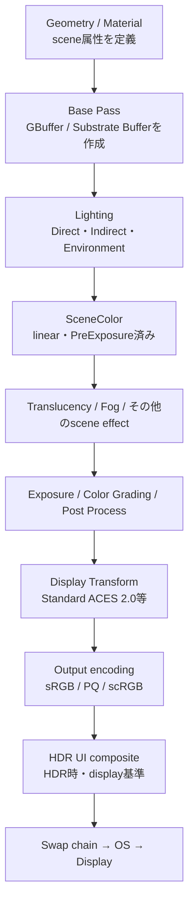
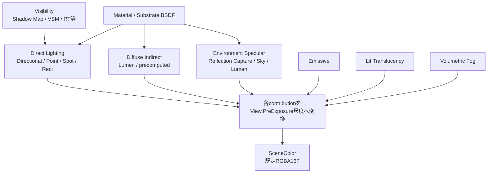
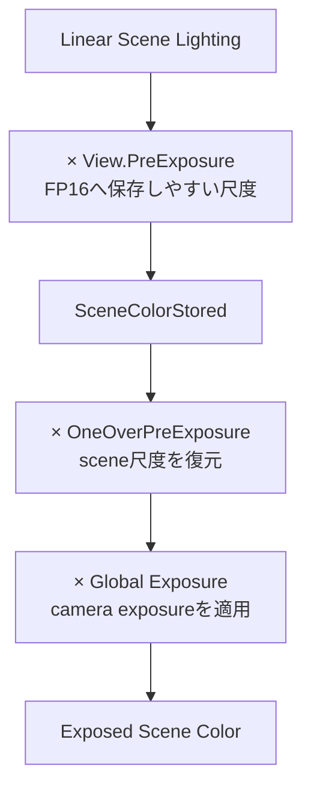
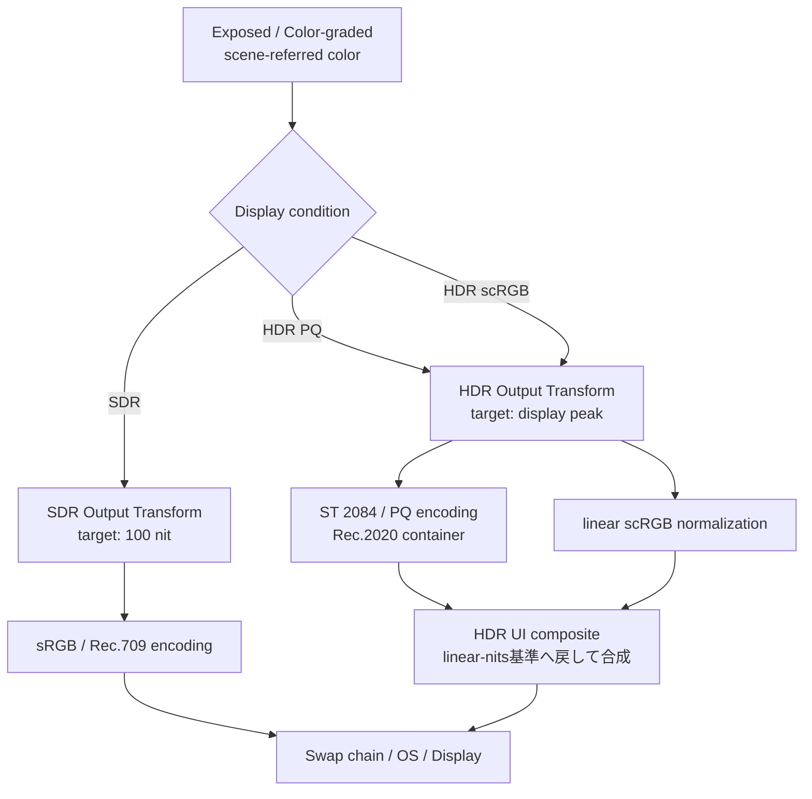

# UE5.8 ライティング仕様ポータル

このページは、UE5.8の「Materialに設定した値が、Lightで照らされ、SceneColorへ蓄積され、最終的にSDR／HDR displayへ届くまで」を一続きに把握するための入口である。

個別ページを独立した話題として読むのではなく、まずこのページで各処理の位置と役割を掴み、必要な部分へ降りる。

> [!important] 調査の前提
> UE5.8、Desktop Deferred Renderer、Substrate、Movable Lightを中心とする。GIはLumenまたは無効＋SkyLight。HDR出力のplatform固有説明は主にWindows／D3D12で確認した内容である。

## 最初に覚える3つの領域

| 領域 | 何を決めるか | 値の基準 |
|---|---|---|
| Scene Lighting | scene内で光がどのように表面／mediumへ届き、反射・透過・散乱するか | scene-referred、linear RGB |
| View／Camera | sceneの明るさをcameraとしてどの露出で観察するか | Exposure、PreExposure |
| Display Output | scene画像をdisplayのpeak、gamut、encodingへどう写像するか | display-referred、nit、PQ／sRGB等 |

`Light intensity`、`Exposure`、`Paper White`をすべて「画面を明るくする値」として同列に扱うと理解しにくくなる。それぞれ別領域の値である。

## 1. MaterialからDisplayまでの主経路

図がObsidianの本文幅を超えないよう、全図を上から下へ読む構成にしている。

### 各段階で読むページ

| 段階 | ここで決まること | 詳細 |
|---:|---|---|
| 1 | 対象Rendererと用語の境界 | [[01_対象範囲と全体像]] |
| 2 | linear計算、FP16保存、PreExposure | [[02_線形空間・SceneColor・PreExposure]] |
| 3 | GBufferとSubstrate closure | [[03_Deferred Base PassとSubstrate]] |
| 4 | Light、BSDF、Shadowの関係 | [[04_直接光・Shadow・Substrate BSDF評価]] |
| 5 | Lumen、SkyLight、Reflection Capture | [[05_間接光・SkyLight・Reflection]] |
| 5A | ベイク済み空間照明、Surface Lightmapとの違い | [[05A_Volumetric Lightmap・Surface Lightmap]] |
| 6 | Lit Translucency、TLV、Forward shading | [[06_Lit Translucency]] |
| 7 | participating mediumとfroxel積分 | [[07_Volumetric Fog]] |
| 8 | ExposureとACES Output Transform | [[08_Exposure・Post Process・Tonemap]] |
| 9 | SDR／HDR、Paper White、UI、swap chain | [[09_HDR Display Output・Paper White・UI]] |

## 2. SceneColorへ何が集まるか

SceneColorは「Lightの設定値そのものを並べたbuffer」ではなく、各経路で計算されたradiance contributionを共通のPreExposure尺度へ揃えて蓄積するHDR画像である。

### ここで区別するもの

- Direct Lighting: Lightごとの方向、形状、減衰とBSDF応答
- Shadow: 現在のLightからそのshading pointが見えるかというvisibility
- Diffuse Indirect: 他surface等を経由して届く低周波照明
- Environment Specular: cubemap、screen trace、Lumen Reflection等から得る反射
- Emissive: Material自身が加えるscene-linear radiance
- Translucency: Opaque Deferredとは異なるforward系評価とSceneColor合成
- Volumetric Fog: surfaceではなくmedium内の散乱・吸収

## 3. SceneColorとExposure

PreExposureとExposureは同じ処理ではない。

Auto ExposureはSceneColorの輝度分布からGlobal Exposureを計算する。PreExposureは主に前frame由来のExposureを利用してSceneColor保存範囲を安定させるため、現在frameの急変を完全には予測しない。

詳細: [[02_線形空間・SceneColor・PreExposure]]、[[08_Exposure・Post Process・Tonemap]]

## 4. Display Outputはどこで分かれるか

SDRとHDRは「同じ完成Tonemap画像へ最後に別encodingを掛けるだけ」ではない。Display conditionがACES Output Transformへ入力されるため、tone scale／gamut mappingの結果自体が変わる。

> [!note]
> PQはlinear nitをHDR signal valueへ対応させるtransfer functionであり、ACESのtone／gamut mappingそのものではない。

詳細: [[08_Exposure・Post Process・Tonemap]]、[[09_HDR Display Output・Paper White・UI]]

## 5. 特殊な3D volumeを混同しない

| Volume                       | 中身                                 | 主な利用者                        |
| ---------------------------- | ---------------------------------- | ---------------------------- |
| Translucency Lighting Volume | Movable Light等を圧縮した低解像度照明          | Lit Translucency             |
| Lumen Translucency GI Volume | Lumen Dynamic GI＋shadowed SkyLight | Translucency、Volumetric Fog等 |
| Volumetric Fog froxel volume | Mediumのscattering／extinctionと積分結果  | Fog composite、Translucency等  |
| Volumetric Lightmap          | Lightmassによるprecomputed irradiance SH等 | Movable object、Lit Translucency、Fog等 |

TLVはfog densityではなく、Volumetric FogはTranslucent surface用Light cacheではない。VLMはActor専用Lightmapではなく、Level／world空間にベイクされたdataである。

詳細: [[05A_Volumetric Lightmap・Surface Lightmap]]、[[06_Lit Translucency]]、[[07_Volumetric Fog]]

## 6. 目的別の読み方

### LightとShadowの計算を知りたい

[[03_Deferred Base PassとSubstrate]] → [[04_直接光・Shadow・Substrate BSDF評価]] → [[05_間接光・SkyLight・Reflection]]

Static LightingとMovable objectのベイク済み間接光も扱う場合は、続けて[[05A_Volumetric Lightmap・Surface Lightmap]]を読む。

### ガラス、particle、半透明を知りたい

[[03_Deferred Base PassとSubstrate]] → [[06_Lit Translucency]] → [[05_間接光・SkyLight・Reflection]]

### Fogやvolume particleを知りたい

[[07_Volumetric Fog]]を先に読み、surface translucencyとの比較が必要なら[[06_Lit Translucency]]へ進む。

### ExposureからHDR TV出力を知りたい

[[02_線形空間・SceneColor・PreExposure]] → [[08_Exposure・Post Process・Tonemap]] → [[09_HDR Display Output・Paper White・UI]]

### 実装確認や調整をしたい

[[10_設定・診断・既知の不明点]] → [[11_用語集と根拠の読み方]]

## 7. この資料での図の読み方

- 原則として上から下へ読む。
- 矢印はresource／値の依存関係を表す。
- 図中の順序は、必ずしもGPU passが完全に直列実行されることを意味しない。
- async computeやfeature permutationで重なる処理は、個別ページで条件を説明する。
- 詳細を1枚へ詰め込まず、portal図→各機能図の順に展開する。

## 補助資料

- [[10_設定・診断・既知の不明点]]
- [[11_用語集と根拠の読み方]]
- [[90_調査資料/00_調査資料について|調査過程・旧Q&A・外部資料照合]]

