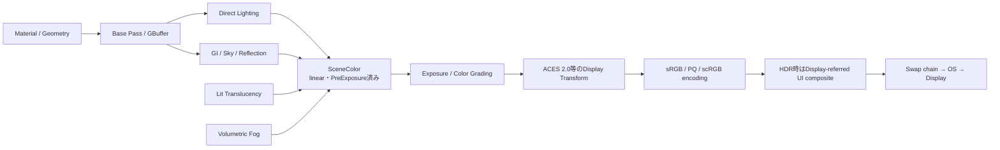

# UE5.8 ライティング仕様

このVaultは、UE5.8デスクトップDeferred Rendererを中心に、Material入力からDisplay出力までを体系化した仕様書である。調査過程のQ&Aや外部記事の照合結果は[[90_調査資料/00_調査資料について]]へ分離した。

## 推奨読書順

1. [[01_対象範囲と全体像]]
2. [[02_線形空間・SceneColor・PreExposure]]
3. [[03_Deferred Base PassとSubstrate]]
4. [[04_直接光・Shadow・Substrate BSDF評価]]
5. [[05_間接光・SkyLight・Reflection]]
6. [[06_Lit Translucency]]
7. [[07_Volumetric Fog]]
8. [[08_Exposure・Post Process・Tonemap]]
9. [[09_HDR Display Output・Paper White・UI]]
10. [[10_設定・診断・既知の不明点]]
11. [[11_用語集と根拠の読み方]]

## 全体経路

> [!important]
> 図はデータ依存関係を示す。GPU passの開始順を完全に直列化した図ではない。

