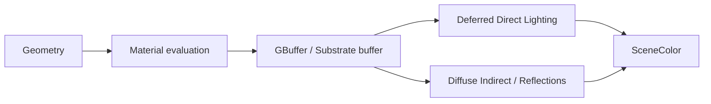

# Deferred Base PassとSubstrate

## Base Pass

Opaque／Masked MaterialはBase Passでsurface属性をGBuffer／Substrate material bufferへexportする。Direct Lightの最終色をすべてここで計算するわけではない。

## Substrateの構造

Substrate Materialは一つ以上のBSDFとoperatorによるtreeを作る。runtimeではvisibleなBSDF／closureを列挙し、共有normal basis、coverage、transmittance、layer情報を使ってLightingを評価する。

主なnative BSDF typeは次のとおり。

| BSDF | 用途 |
|---|---|
| Slab | 一般surface。Diffuse、F0/F90、roughness、anisotropy、SSS、fuzz等 |
| Hair | 毛髪繊維 |
| Eye | 眼球 |
| Single Layer Water | 専用water path |
| Volumetric-Fog-Cloud | participating medium用Volume Domain |
| Unlit | 非照明 |
| Toon | UE5.8ではExperimental |

`Substrate Shading Models` nodeはlegacy Shading Modelを主にSlab＋featureへ変換する互換入口である。

## Closure

Closureは「そのpixelでLighting評価可能な一つの散乱応答単位」と捉える。layer／mix結果からvisible closureが構成され、LightごとにBSDF contextを作る。単なるlegacy Shading Model IDでも、完成した色でもない。

## SceneColorへの出力

各passで得たDiffuse、Specular、Transmission、Emissive等をLighting accumulatorへ統合し、SceneColorのPreExposure尺度に揃えて加算する。

