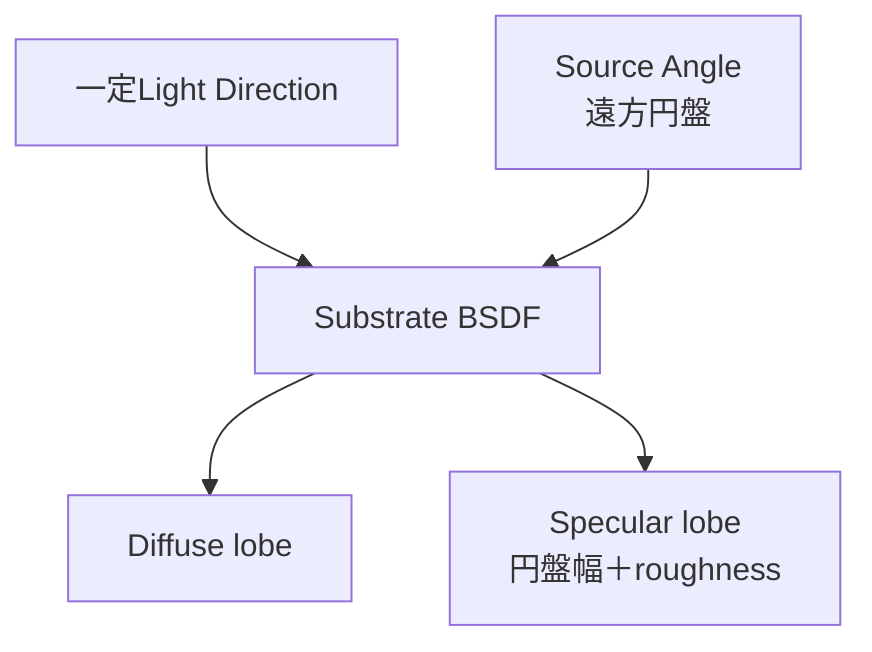
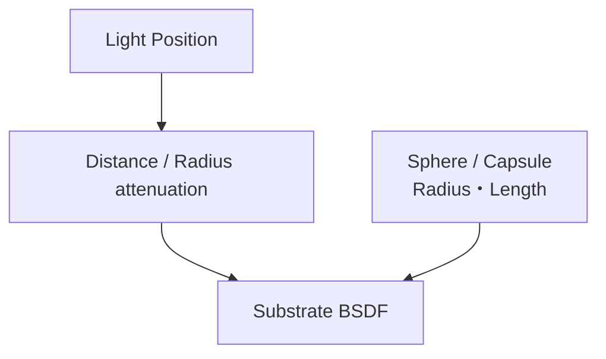

# Directional・Point・Spot Light

Directionalは距離を持たない平行光、Pointは全方向の局所radial light、SpotはPoint系へcone maskを加えた光源である。PointとSpotはBSDF評価の大部分を共有する。

## 比較

| 項目 | Directional | Point | Spot |
|---|---|---|---|
| Light vector | 全shading pointでほぼ一定 | surfaceからLight位置 | surfaceからLight位置 |
| 距離減衰 | なし | あり | あり |
| 方向制限 | なし | 全方向 | Inner／Outer cone |
| Source shape | 無限遠円盤の角度 | sphere／capsule | sphere／capsule＋cone |
| Shadow coverage | view／scene範囲 | 6方向 | 単一frustum |

## Directional Light

Directional LightはLight Positionや逆二乗減衰を使わず、シーン全体へ同方向から届く。Deferred LightではDirectional専用source-shape permutationを選ぶ。

`LightSourceAngle`は無限遠光源のangular diameterで、UE 5.8のsource comment上のdefaultは太陽相当の約`0.5357°`である。`LightSourceSoftAngle`とRay Tracing用`ShadowSourceAngleFactor`もある。



Diffuseはclosureと光方向の関係を評価する。SpecularはroughnessだけでなくSource Angleでも広がる。ShadowはVSM clipmap、CSM、RT、Distance Field等の条件付き経路を持つ。

## Point Light

Point Lightは`Attenuation Radius`内の全方向へ届く。物理減衰時は距離とradius端のsmooth maskを使い、非物理減衰時は`LightFalloffExponent`のradial attenuation経路を使う。

- `SourceRadius`: sphere／capsuleの半径
- `SoftSourceRadius`: soft source近似用半径
- `SourceLength`: 0より大きいと線分を持つcapsule状光源

Deferred LightingはPoint／Spot系を`FCapsuleLight`へ構成し、DiffuseとSpecularのarea-light近似へ渡す。Source RadiusはSpecularだけのparameterではないが、見た目の形状差はSpecularで目立ちやすい。



## Spot Light

Spot LightはPoint系local attenuationの後に`SpotAttenuation()`を乗算する。

```text
Point系distance attenuation
× Inner / Outer cone attenuation
× source-shape BSDF integration
```

Inner Cone内は最大、InnerからOuterでfadeし、Outer外はゼロになる。Coneを通過した後のDiffuse／Specular評価とSource Radius／LengthはPoint系を共有する。

## 注意点

- Attenuation Radiusは描画範囲を有限化する境界も兼ねる。
- Source shapeがshadow caster geometryへ交差するとartifactを生じ得ることがComponent source commentに明記されている。
- MegaLightsではLightの実行・shadow sampling方法が変わり得るため、Standard Deferredのpass回数を一般化しない。

## 根拠

- `Engine/Shaders/Private/DeferredLightingCommon.ush:246-312`
- `Engine/Source/Runtime/Engine/Classes/Components/DirectionalLightComponent.h:132-151`
- `Engine/Source/Runtime/Engine/Classes/Components/PointLightComponent.h:39-77`
- `Engine/Source/Runtime/Renderer/Private/LightRendering.cpp:3439-3446`

## Navigation

- 前: [[04_直接光・Shadow・Substrate BSDF評価]]
- 次: [[04B_Rect Lightと面積光源]]
- Shadow: [[04C_Light Type別Shadow]]
- Portal: [[00_UE5.8ライティング仕様_Index]]
