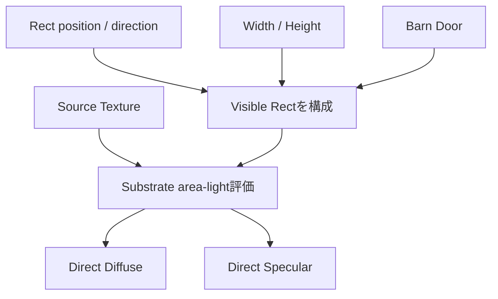

# Rect Lightと面積光源

Rect LightはPoint LightのSource Radiusを大きくしたものではなく、向きを持つ矩形面光源である。前面側だけを照らし、DiffuseとSpecularへ矩形積分を使う。

## 光源形状

- Source Width／Height
- Light Direction／Tangent
- Barn Door Angle／Length
- Source Texture
- Attenuation Radius

`GetLocalLightAttenuation()`はlocal distance attenuationに加えて矩形前面判定を行う。`GetRect()`は形状、向き、Barn Doorからsurface位置に対する可視矩形を作る。Barn Doorで矩形が不可視ならSubstrate deferred lightingは寄与なしで戻る。

## Diffuse

RectのDiffuseは中心点だけの`NoL`ではなく、surfaceから見える矩形のsolid angleを積分する。UE shaderには`IntegrateLight(Rect)`経路がある。大きなRectをsurfaceへ近づけると、Point Lightとは異なる照度分布になる。

## Specular

Specularでは矩形面をGGX系lobeへ積分し、通常品質ではLTC系近似等を使う。低roughnessでは矩形に近いhighlight、高roughnessでは広くblurしたhighlightになる。Source Textureは矩形の発光模様をarea-light評価へ渡せる。

## Shadowとの非対称性

> [!important]
> BSDFが矩形面を積分しても、すべてのshadow方式が矩形面上の可視性を厳密積分するとは限らない。

通常projected Shadow、VSM＋soft-shadow近似、Ray Traced Shadowでは半影の求め方が違う。Rect Lightには専用Depth Bias、Slope Scale Bias、Receiver Biasがある。矩形highlightが正しく見えていても、shadow penumbraが同じ精度で矩形を再現するとは限らない。

## 根拠

- `Engine/Shaders/Private/DeferredLightingCommon.ush:279-300, 532以降`
- `Engine/Shaders/Private/Substrate/SubstrateDeferredLighting.ush:151以降`
- `Engine/Shaders/Private/RectLightIntegrate.ush`
- `Engine/Source/Runtime/Engine/Private/Components/RectLightComponent.cpp`
- `Engine/Source/Runtime/Renderer/Private/ShadowRendering.cpp:99-116`

## Navigation

- 前: [[04A_Directional・Point・Spot Light]]
- 次: [[04C_Light Type別Shadow]]
- Portal: [[00_UE5.8ライティング仕様_Index]]
