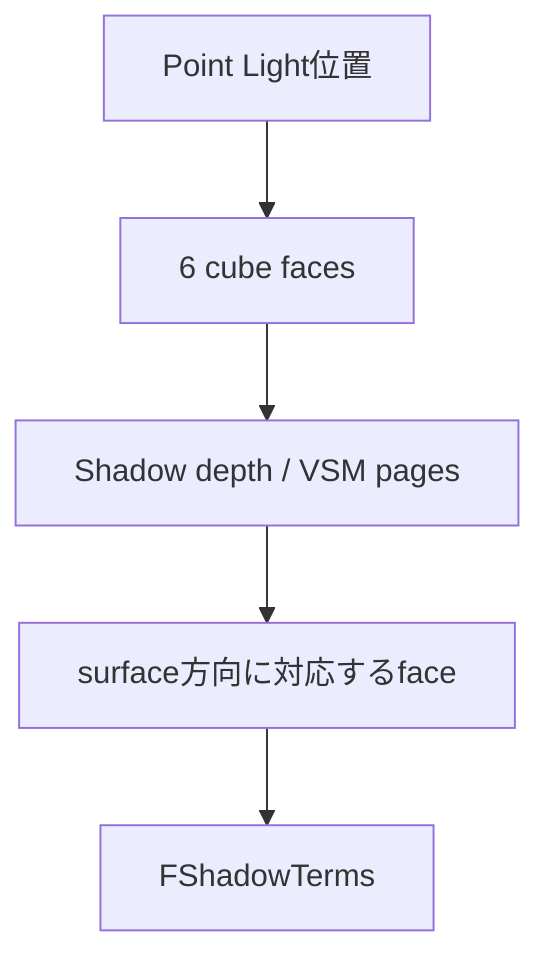

# Light Type別Shadow

ShadowはLight Typeごとの投影範囲と、VSM／従来Shadow Map／Ray Tracing等の選択で実装が変わる。以下はDesktop Deferredの概念整理であり、一つの固定pass列ではない。

## 投影範囲

| Light | depth／visibility coverage | 特徴 |
|---|---|---|
| Directional | camera周囲のclipmapまたはcascade | 無限遠方向光、広範囲 |
| Point | Light位置を囲む6方向 | 全方向のため高いcoverage cost |
| Spot | Light位置からcone方向の透視frustum | cone内だけを覆う |
| Rect | 前面側のlocal projected shadow | 面積光源visibilityは方式依存 |
| Sky | conventionalなLight単位Shadow Mapなし | Bent Normal／AO／Sky visibility |

## Directional

Virtual Shadow Mapではcamera周囲のclipmap、従来Shadow MapではCascaded Shadow Mapを使用できる。Ray Traced、Distance Field、Contact、Cloud Shadow等も条件付きで合成される。

## Point

One Pass Point Light Shadowでは6個のview projection matrixを作る。

6方向を覆うため、同程度のcaster数・解像度ならSpotより重くなりやすい。実際のcostはVSM cache、Nanite、screen coverage、caster数で変わる。

## Spot

Spotは単一coneの透視frustumで覆える。Outer Coneが広いほど同解像度が広い角度へ配分され、実効texel密度が下がる。

## Rect

Rectにもlocal projected shadowと専用biasがある。ただしShadow Mapの中心投影やfilterだけでは矩形面上の完全な可視性積分にならない。VSMのsoft-shadow samplingやRT shadowではsource sizeを別方式で利用する。

## Shadow Termsへの統合

Deferred shadow projectionのLight Attenuation channelにはwhole-scene／non-whole-scene、SSS／non-SSSの区別がある。`GetShadowTermsBase()`がこれらとprecomputed shadow factorを現在Lightの`FShadowTerms`へまとめる。

- Surface Shadow
- Transmission Shadow
- Hair Transmittance
- Contact Shadow等の追加visibility

ShadowはLight個別であり、複数Light共通の一枚の完成shadowをBSDFへ渡すわけではない。

## Sky Lightとの違い

Skyは無数の方向から届く環境光なので、Point／Spotのような単一depth projectionを持たない。Bent Normal、Sky Visibility、DFAO、Material／Screen AO、Lumen Sky Occlusion、precomputed Sky occlusion等で遮蔽する。

## 根拠

- `Engine/Source/Runtime/Renderer/Private/ShadowSetup.cpp:1145-1191, 2638-2656, 4252-4271`
- `Engine/Source/Runtime/Renderer/Private/ShadowRendering.cpp:659-873`
- `Engine/Shaders/Private/DeferredLightingCommon.ush:90-243`

## Navigation

- 前: [[04B_Rect Lightと面積光源]]
- Sky: [[05_間接光・SkyLight・Reflection]]
- Portal: [[00_UE5.8ライティング仕様_Index]]
