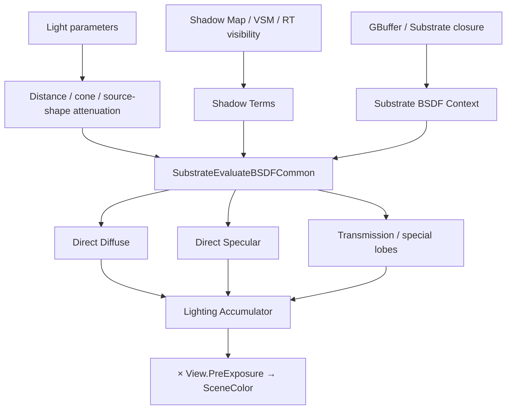

# 直接光・Shadow・Substrate BSDF評価

## Deferred Direct Lighting

Movable Directional／Point／Spot／Rect Lightは、画面またはcluster／tileで影響pixelを絞り、Light単位・visible closure単位でSubstrate BSDFを評価する。

## ShadowをBSDF評価へ渡す理由

Shadowは完成色へ一律に黒を掛けるだけではない。Subsurface、Transmission、Hair、Contact Shadowなどで項ごとの扱いが異なるため、UEは`FShadowTerms`をBSDF評価へ渡す。

- Light distance／cone attenuationは`LightMask`側
- occluder visibilityはShadow Terms側
- Light Function、Light Color、Lighting Channel等も共通寄与を構成

Shadow情報は基本的に現在評価しているLightに対応する。Lightごとにvisibilityを取得し、そのLightと現在closureの評価へ渡す。

## Shadow source

構成によりShadow Map、Cascaded Shadow Map、Virtual Shadow Map、ray traced shadow、contact shadow等を使用する。すべてを同時に同じ式で使うとは限らず、Light type、project設定、platform、passで分岐する。

## Light分類

Clustered／Batched／Standard／MegaLights等はLightの発見・実行方式を変える。最終的に必要なのは、Light方向・形状・減衰・visibilityとMaterial BSDFを対応付けることである。

