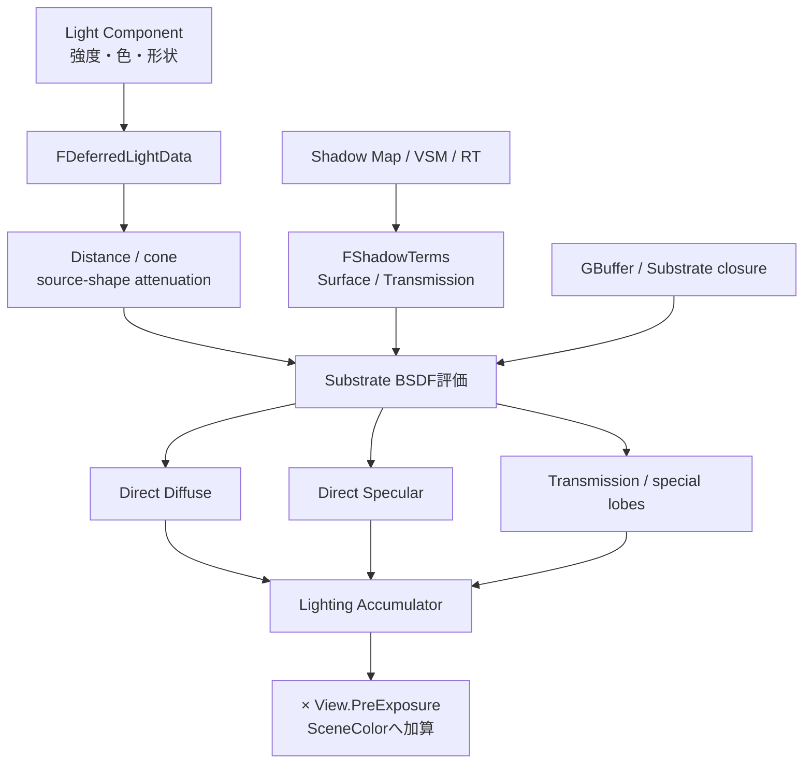

# 直接光・Shadow・Substrate BSDF評価

Movable Directional／Point／Spot／Rect Lightは、光源形状と到達範囲こそ異なるが、最終的にはLight Data、attenuation、Light単位のvisibility、Substrate closureを対応付けてDirect Diffuse／Specular／Transmission等を求める。

> [!note]
> Direct LightはLight Type名ではなく、光源からshading pointへ直接届く成分である。Light Type名はDirectional Lightである。

## 共通経路



図はdata依存関係であり、全GPU passの厳密な直列順を保証しない。

## Diffuse・Specular・Shadowの関係

Diffuse用LightとSpecular用Lightを別に作るのではない。同じLightとclosureから複数のBSDF lobeを評価する。

| 入力 | 意味 |
|---|---|
| Light direction／shape | どこから、どの大きさで光が届くか |
| Attenuation | 距離、Attenuation Radius、Spot cone、Rect前面判定 |
| Diffuse closure | diffuse albedo、rough diffuse、subsurface等 |
| Specular closure | F0／F90、roughness、anisotropy等 |
| Shadow Terms | 現在のLightに対するsurface／transmission visibility |

```text
Direct Diffuse  ≈ Light × Attenuation × Diffuse BSDF × Surface visibility
Direct Specular ≈ Light × Attenuation × Specular BSDF × Surface visibility
Transmission    ≈ Light × Attenuation × Transmission BSDF × Transmission visibility
```

Substrateではclosureごとの透過・散乱があるため、完成色へ最後に一枚のshadowを乗算する説明では不足する。Light Dataには`DiffuseScale`と`SpecularScale`が分離して存在する。Light単位で片方を弱められるが、物理的整合性を崩し得るartist controlである。

## Light分類と実行方式を分ける

Directional／Point／Spot／Rectは光源モデルである。Standard Deferred、Clustered／Batched、MegaLightsはLightを発見・実行する方式であり、同じ分類ではない。実行方式でpass構成は変わり得るが、BSDFに必要な光方向・形状・減衰・visibilityという意味は残る。

## 読み順

1. [[04A_Directional・Point・Spot Light]]
2. [[04B_Rect Lightと面積光源]]
3. [[04C_Light Type別Shadow]]
4. [[05_間接光・SkyLight・Reflection]]

## 根拠

- `Engine/Shaders/Private/DeferredLightingCommon.ush:90-313, 524以降`
- `Engine/Shaders/Private/Substrate/SubstrateDeferredLighting.ush:143以降`
- `Engine/Shaders/Private/Substrate/SubstrateEvaluation.ush:1380-1390`
- `Engine/Source/Runtime/Renderer/Private/LightRendering.cpp:3439-3446`

## Navigation

- 前: [[03_Deferred Base PassとSubstrate]]
- 次: [[04A_Directional・Point・Spot Light]]
- Portal: [[00_UE5.8ライティング仕様_Index]]
