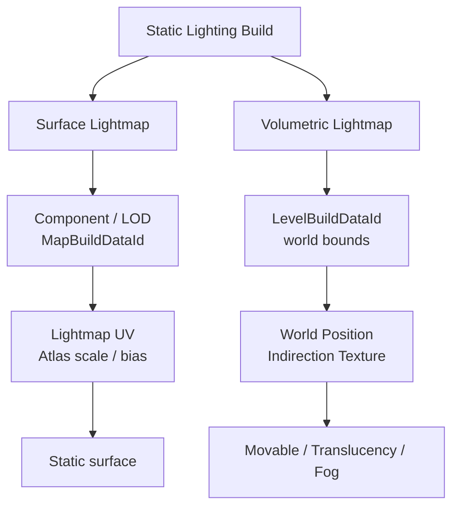
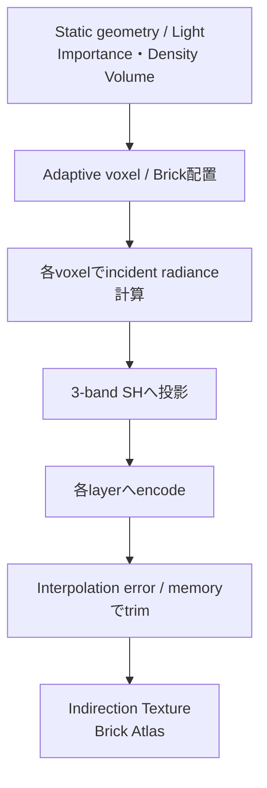
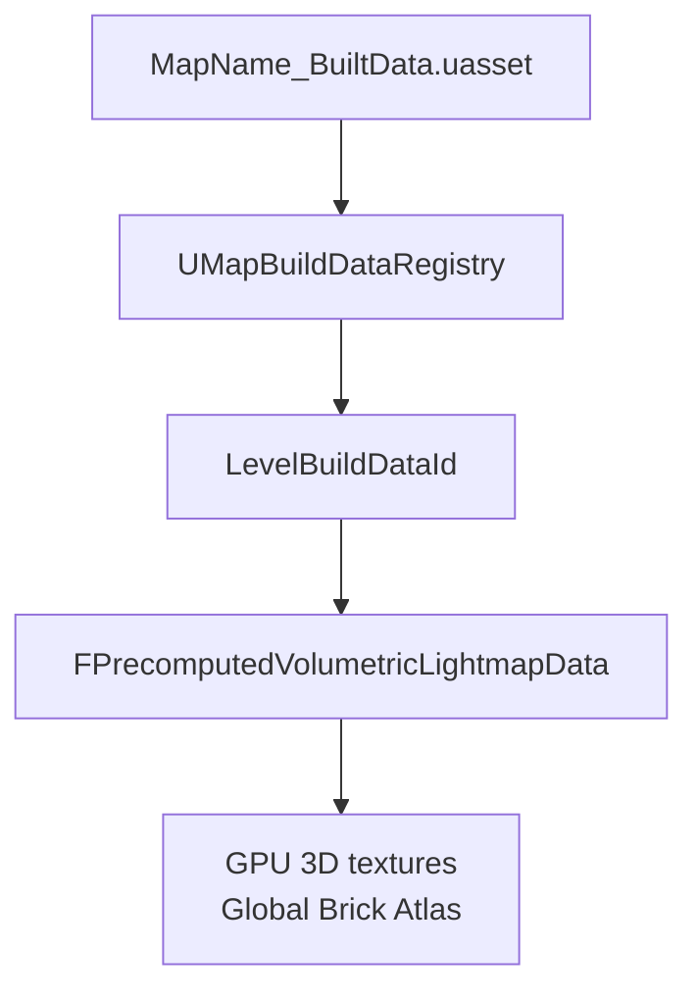
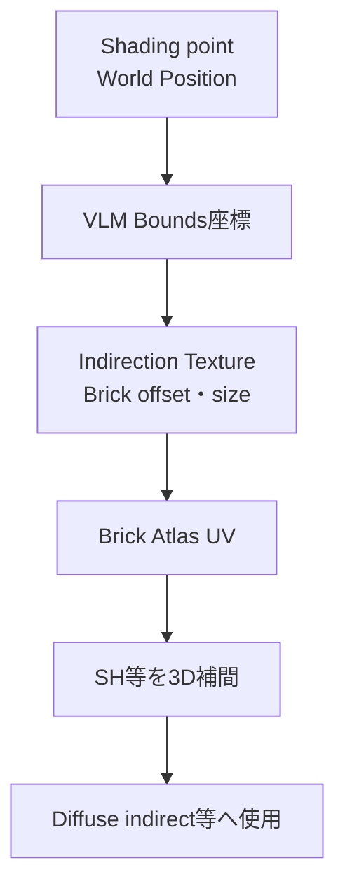

# Volumetric LightmapとSurface Lightmap

Volumetric Lightmap（VLM）はLightmassがworld空間へベイクする適応的な3D irradiance dataである。Surface Lightmapのように特定Static Mesh Actorが専用textureを直接参照する方式ではないが、Static Meshの形状・位置・materialはVLM生成の入力である。Actor変更後に再buildしなければ、現在geometryと古いVLMが食い違い得る。

> [!important] 適用条件
> このページはStatic Lightingをbuildする構成を扱う。本資料の中心前提である「すべてのLightがMovable」では、それらMovable Lightの直接光や間接光はLightmass VLMへベイクされない。LumenもVLMとは別経路である。

## 1. Surface Lightmapとの違い

| 項目 | Surface Lightmap | Volumetric Lightmap |
|---|---|---|
| 所有単位 | Static Mesh Component／LOD | Level／world空間 |
| 検索 | `MapBuildDataId`＋Lightmap UV | World Position＋Indirection Texture |
| resource | 2D Lightmap／Shadow Map、VTを含む | 適応Brickを詰めた3D texture atlas |
| 主なreceiver | Static surface | Movable object、Lit Translucency、Fog等 |
| 主な量 | 表面用ベイク照明 | 低周波incident radiance SH等 |

矢印はdata依存関係であり、厳密なGPU pass順ではない。

## 2. VLMに格納されるもの

| layer | 格納量 | 消費側の意味 |
|---|---|---|
| `AmbientVector` | 3-band SHのL0 RGB | incident radianceの基準成分 |
| `SHCoefficients[6]` | Ambientで正規化・8 bit packされた方向係数 | normal方向の間接拡散照明評価 |
| `SkyBentNormal` | Skyが開けた方向と可視性 | SkyLightのprecomputed occlusion |
| `DirectionalLightShadowing` | 8 bitの静的遮蔽係数 | Stationary Directional Lightのshadow mask相当 |

検索用に`Bounds`、`IndirectionTexture`、`BrickSize`、`BrickDataDimensions`、atlas offset、sublevel streaming情報も保存する。Import時のformatはAmbientが`PF_FloatR11G11B10`、SHとSky Bent Normalが8 bit RGBA、Directional shadowingが`PF_G8`である。

SHは鋭いspecular反射像を保存しない。Base PassではVLMのSHとsurface normalからDiffuse Transfer SHを作り、内積して間接拡散光を求める。

## 3. Lightmassでの生成

ジオメトリ付近、Importance／Density Volume内、光変化が大きい場所を細分化する。最高密度は`VolumetricLightmapDetailCellSize`で決まり、粗い階層はその4倍、16倍のcell sizeを使う。

Static Lightの直接光はベイク成分へ合成され得る。Stationary Lightは主に間接成分をベイクし、Stationary Directional Lightの静的遮蔽は`DirectionalLightShadowing`へ別保存する。Movable LightはLightmass VLMへベイクされない。

背面hit率が0.3を超えるsampleは`bInsideGeometry`になる。Brick内の全cellが内部なら末端Brickは破棄される。一部だけ内部の場合はBrick全体が必ず破棄されるわけではない。

## 4. 保存とruntime upload

通常の非World Partition mapでは、Levelの`LevelBuildDataId`をkeyとして`UMapBuildDataRegistry`へ保存される。packageは通常`MapName_BuiltData.uasset`である。

LevelをSceneへ追加するとRegistryと`LevelBuildDataId`からdataを取得する。RHI初期化時にIndirection、Ambient、6枚のSH、Sky Bent Normal、Directional shadowingの3D textureを作り、Brickをglobal atlasへ入れる。

World Partitionでは`AMapBuildDataActor`、cell単位Registry、VLM gridを利用し、cell streamに応じてatlasとpersistent Indirection Textureを更新する。通常mapの単一BuiltData packageと同一視しない。

## 5. receiverとの紐づき

VLMを読むreceiverはActor GUIDでsampleへ結び付かない。shaderはshading pointのWorld PositionからBrick UVを計算する。

Base Pass、Lit Translucency、Hair、Volumetric Fogなどにconsumerがある。Translucency Lighting ModeによってSH1／SH2／SH3やper-vertex経路が変わる。FogのMovable Light直接散乱は別処理である。

## 6. Actor変更とLighting Build警告

Actorとの関係には二種類ある。

1. Surface Lightmapの直接参照: Component／LODの`MapBuildDataId`が専用`FMeshMapBuildData`を引く。
2. VLM生成入力としての依存: Actor形状、位置、materialが遮蔽、radiance、sample密度を変えるが、runtime参照にActor GUIDを使わない。

Static Mesh render data変更などでは`InvalidateLightingCache()`が呼ばれる。一方、この個別無効化からLevel単位VLMを即時削除する経路は確認できなかった。

> [!warning]
> `Lighting needs to be rebuilt`中は、変更後geometry、無効またはpreview状態のSurface Lightmap、変更前VLMが一時的に共存し得る。警告はVLMだけを指さないが、VLMが現在geometryと一致する保証もない。

## 7. 局所的な暗部が現れる条件

- 古い遮蔽: Build時の壁を移動・削除すると、壁の裏側に作られた暗いsampleがworld空間へ残り得る。
- geometry内部sample: 薄い壁、重複面、裏返ったnormal、閉じていない／交差したmeshでは暗いsampleが表面近傍の補間へ影響し得る。
- densityとmemory trim: 非World Partitionでは`VolumetricLightmapMaximumBrickMemoryMb`超過時に最高密度Brickをgeometryから遠い順に削除する。UE 5.8 defaultは30 MB。build logの`trimmed ... due to ... MaximumBrickMemoryMb`で確認する。

Brickには補間borderがあり、階層境界をそのまま不連続線にする設計ではない。明確な線だけでBrick seamとは断定しない。

VLMはspecular cubemapを保持しない。暗部がviewで動く、metal／roughnessで大きく変わる場合はReflection Capture、SkyLight cubemap、SSR、Lumen Reflectionを先に切り分ける。個別現象はruntime captureなしには確定できない。

## 8. 診断手順

1. 暗部がworld、mesh表面、viewのどれに固定されるか分類する。
2. Viewportの`Visualize Volumetric Lightmap`を有効にする。
3. 暗いsample、density変化、geometry内部sampleを確認する。
4. build logのmemory trimを確認する。
5. Static Lighting再build前後を同じcamera／exposureで比較する。
6. view依存ならReflection系を個別に比較する。

## 根拠

- `Engine/Source/Runtime/Engine/Public/PrecomputedVolumetricLightmap.h`
- `Engine/Source/Runtime/Engine/Private/PrecomputedVolumetricLightmap.cpp`
- `Engine/Source/Runtime/Engine/Classes/Engine/MapBuildDataRegistry.h`
- `Engine/Source/Runtime/Engine/Private/Level.cpp:3960-4003`
- `Engine/Source/Runtime/Engine/Private/Components/StaticMeshComponent.cpp:3407-3414, 3600-3684`
- `Engine/Source/Programs/UnrealLightmass/Private/Lighting/AdaptiveVolumetricLightmap.cpp:647-703, 877-945`
- `Engine/Source/Programs/UnrealLightmass/Private/Lighting/LightingSystem.inl:107-219`
- `Engine/Source/Editor/UnrealEd/Private/Lightmass/ImportVolumetricLightmap.cpp:869-1091, 1349-1608`
- `Engine/Shaders/Private/VolumetricLightmapShared.ush:25-136`
- `Engine/Shaders/Private/BasePassPixelShader.usf:572-608, 1143-1154`
- `Engine/Shaders/Private/LightmapCommon.ush:274-284`
- `Engine/Source/Runtime/Renderer/Private/VisualizeVolumetricLightmap.cpp:29-152`
- `Engine/Source/Runtime/Engine/Classes/GameFramework/WorldSettings.h:154-169, 226-229`

## Navigation

- 前: [[05_間接光・SkyLight・Reflection]]
- 関連: [[06_Lit Translucency]]、[[07_Volumetric Fog]]
- 診断: [[10_設定・診断・既知の不明点]]
- Portal: [[00_UE5.8ライティング仕様_Index]]
