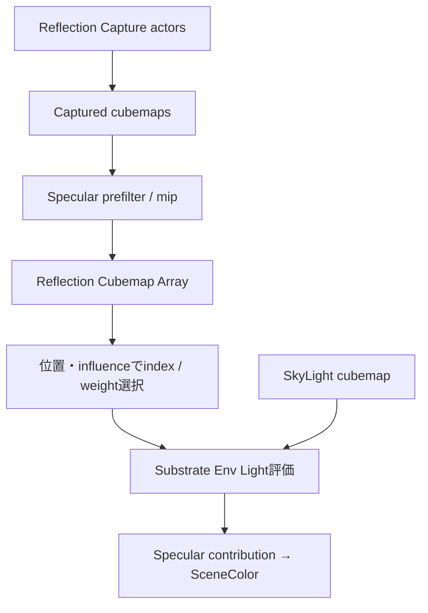

# 間接光・SkyLight・Reflection

## Diffuse IndirectとSpecular Environment

Diffuse GI、Sky diffuse、Reflection Capture、Sky specular、SSR、Lumen Reflectionは別の信号である。名称に「Reflection」があっても同じresourceへ常に加算されるわけではない。

## Lumen

Lumen有効時はLumen Scene Lighting／Final GatherからDiffuse Indirectを取得し、Lumen ReflectionsがSpecular環境を担当する。SkyLightはLumenの環境照明へ入り、Reflection Capture／Sky cubemapはfallbackまたは補完になり得る。

## GIなし＋SkyLight

GIを無効化してもSkyLightは環境Diffuseを提供できる。Movable SkyLightではcaptureまたは指定cubemapから環境表現を生成する。Diffuse側は低周波SH、Specular側はprefiltered cubemapを用いる。

## Reflection Capture

Reflection Captureはcapture位置からcubemapを作り、roughnessに応じたprefilter／mipを持つ。複数captureはobject／pixel位置、capture influence、parallax correction等に応じて選択・blendされる。GPUではReflection Cubemap Arrayに複数captureを格納し、indexとweightを使って連続的に合成する。

## SkyLight realtime capture

Realtime Captureと事前生成／Specified Cubemapではsource更新方法が異なるが、利用段階ではDiffuse用低周波表現とSpecular用cubemap表現へ展開される。SHは主にDiffuse irradiance近似であり、鮮明な反射をSHだけで表すものではない。
