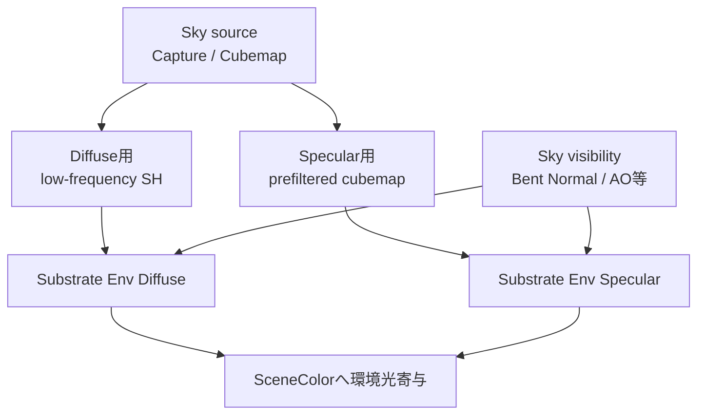
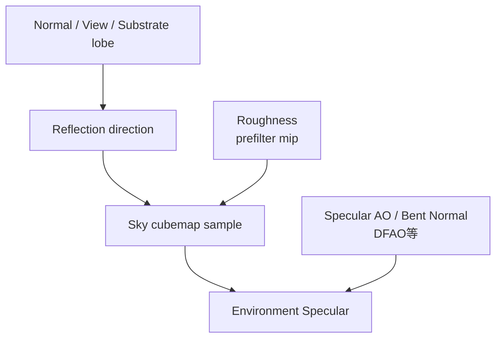
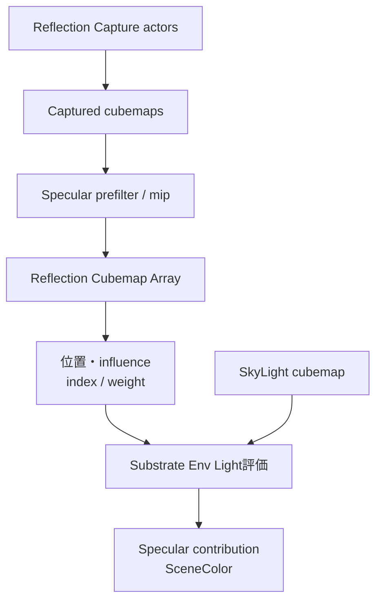

# 間接光・SkyLight・Reflection

Diffuse GI、Sky diffuse、Reflection Capture、Sky specular、SSR、Lumen Reflectionは別の信号である。Sky LightもDirectional／Point／Spot／Rectと同じLight単位のdirect-light passではなく、全方向のenvironment lightingとして評価される。

## Sky Lightの入力

Sky LightのsourceはCaptured Scene、Specified Cubemap、Realtime Captureなどである。更新方法は異なるが、surface lightingでは主にDiffuse用の低周波表現とSpecular用のprefiltered cubemapへ分かれる。



図はresource／値の依存関係であり、capture生成と最終compositeの厳密なGPU順を示さない。

## Sky Diffuse

Substrateのdefault environment inputでは、Sky Diffuseを概ね次で取得する。

```hlsl
GetSkySHDiffuse(BentNormal) * View.SkyLightColor.rgb
```

SHは環境の低周波な方向分布であり、鮮明な光源像を表さない。Substrate側ではDiffuse Weight／Back Face Diffuse Weight、BSDF Throughputと組み合わせる。

遮蔽にはBent Normal／Sky Visibility、Material AO、Screen-space AO、DFAO、Cloud Volumetric AO、VLMのprecomputed Sky Bent Normal、Lumen Sky Occlusion等が構成に応じて関係する。Sky LightにはPoint／Spotのような単一Shadow Mapがない。

## Sky Specular

Sky SpecularはSHではなく、reflection directionとroughnessを使ってSky cubemapをsampleする。



Reflection Capture、Sky cubemap、SSR、Lumen Reflectionは補完・fallback・compositeの関係になり得るが、同一resourceではない。Substrateの`GetEnvSpecularLighting()`はReflection CaptureとSkyを含むenvironment specular経路へ接続する。

## Lumen

Lumen有効時はLumen Scene Lighting／Final GatherからDiffuse Indirectを取得し、Lumen ReflectionsがSpecular環境を担当する。SkyLightはLumenの環境照明へ入り、Reflection Capture／Sky cubemapはfallbackまたは補完になり得る。

## GIなし＋SkyLight

GIを無効化してもSkyLightは環境DiffuseとSpecularを提供できる。GIなしとは「すべての間接／環境光がゼロ」という意味ではない。

## Reflection Capture

Reflection Captureはcapture位置からcubemapを作り、roughnessに応じたprefilter／mipを持つ。複数captureは位置、influence、parallax correction等に応じて選択・blendされる。GPUではReflection Cubemap Arrayに格納し、indexとweightを使って合成する。



## DiffuseとSpecularを混同しない

| 経路 | 主な表現 | 鮮明な像 |
|---|---|---|
| Sky Diffuse | SH | 不可 |
| VLM Diffuse | 3-band SH | 不可 |
| Reflection Capture | prefiltered cubemap | roughness依存 |
| Sky Specular | prefiltered cubemap | roughness依存 |
| SSR | screen-space ray | 画面内情報に限定 |
| Lumen Reflection | Lumen trace | scene representation依存 |

## 根拠

- `Engine/Shaders/Private/Substrate/SubstrateLightingCommon.ush:172-185, 212-316`
- `Engine/Shaders/Private/SkyLightingDiffuseShared.ush`
- `Engine/Shaders/Private/ReflectionEnvironmentComposite.ush:219以降`
- `Engine/Shaders/Private/BasePassPixelShader.usf:466-508, 735-749`
- `Engine/Source/Runtime/Renderer/Private/ReflectionEnvironmentCapture.cpp`

## Navigation

- Direct Light: [[04_直接光・Shadow・Substrate BSDF評価]]
- Light Type別Shadow: [[04C_Light Type別Shadow]]
- Precomputed: [[05A_Volumetric Lightmap・Surface Lightmap]]
- Portal: [[00_UE5.8ライティング仕様_Index]]
