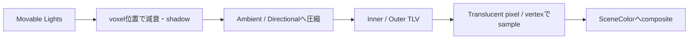

# Lit Translucency

TranslucentはOpaque GBufferへ書いて後から通常Deferred Lightingするのではなく、基本的にTranslucent Base Pass内のforward系shaderで照明し、opacity／transmittanceでSceneColorへ合成する。

## Lighting Mode

| Mode | Direct Diffuse | Direct Specular | 評価位置 |
|---|---|---|---|
| Volumetric NonDirectional | TLV ambient近似 | なし | pixel |
| Volumetric Directional | TLV SH＋normal | なし | pixel |
| Volumetric PerVertex NonDirectional | TLV ambient近似 | なし | vertex→補間 |
| Volumetric PerVertex Directional | TLV SH＋normal | なし | vertex→補間 |
| Surface TranslucencyVolume | TLVによるsurface diffuse | 正確なlocal highlightなし | pixel |
| Surface ForwardShading | Light単位BSDF評価 | あり | pixel |

## 3D Translucency Lighting Volume

TLVは反射光専用ではない。Movable Lightの直接光を、voxel位置で距離／cone減衰、shadow、Light Function等とともに注入する。ただしMaterial固有normal、roughness、F0を使う完全なper-light BSDF評価ではない。

各viewにInner／Outerの2 cascadeを持ち、既定は各64³、距離は1500／5000 uu。各cascadeの`Ambient`／`Directional` 3D textureから圧縮Two-band SHを復元する。

Surface ForwardShadingだけはCulled Light GridのLocal Lightをループし、Light・pixel・Substrate BSDF単位でDiffuse／Specularを評価する。

## Sky／Reflection／Lumen

TLV、Lumen Translucency GI Volume、SkyLight、Reflection Captureは別経路である。Surface系ではReflection Cubemap Arrayをblend可能。Lumen Front Layer Reflection等は条件付きの追加経路となる。

## Substrateと透過

BSDF、Lighting Mode、Blend Modeを分離する。native Slabは透過coatやlayerを構築できる。legacy Thin TranslucentのSubstrate変換はSlabを使い、legacy側にはTranslucent Blend、Surface ForwardShading等の制約がある。

Substrate用blendにはGrey Transmittance、Colored Transmittance、Colored Transmittance Onlyがあり、これはLighting計算法ではなくframebuffer合成規則である。

