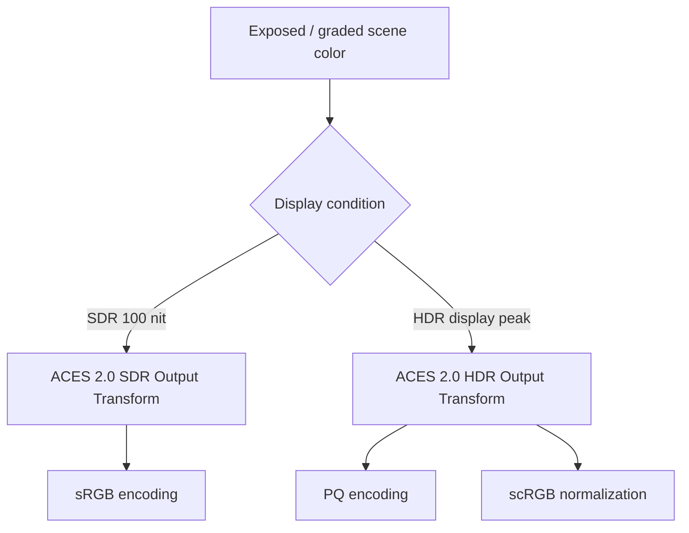

# Exposure・Post Process・Tonemap

## Exposure

Auto ExposureはTonemap前のSceneColorから輝度分布を測定し、Eye Adaptation bufferへGlobal Exposureを生成する。Manual Exposureは設定から固定値を求める。

Tonemap入力の概念式は次のとおり。

```text
ExposedSceneColor = SceneColorStored
                  × OneOverPreExposure
                  × GlobalExposure
                  × SceneColorTint等
```

PreExposureは保存尺度、Global Exposureは現在frameのcamera exposureであり、役割が異なる。

## Post Processの概略

SceneColorへOpaque、Indirect、Translucency、Fog等を統合した後、Bloom、Depth of Field、Motion Blur、Local Exposure、Color Grading、Tonemap等が設定とpass構成に従って処理される。厳密な順序はfeature permutationで変化する。

## Standard ACES 2.0

Standard ACESはTonemapping Method、ACES 2.0はそのOutput Transform versionである。ACES 2.0 Output Transformは単一S字curveではなく、tone scale、gamut mapping、出力色域／peak条件への変換を含む。

SDRとHDRは「同じ完成Tonemap後にencodingだけ分岐」ではない。同じscene inputとACES 2.0 algorithmを共有するが、target peak、gamut、output conditionが異なるためOutput Transform結果も異なる。



PQはlinear nitsを信号値へ符号化するEOTF／inverse EOTF関係であり、Tonemapそのものではない。
