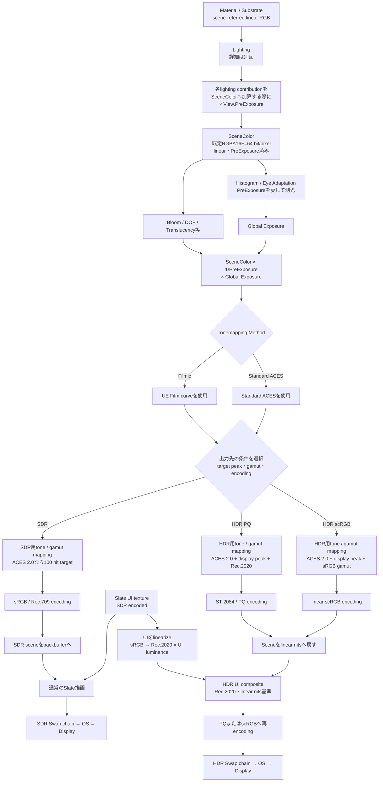
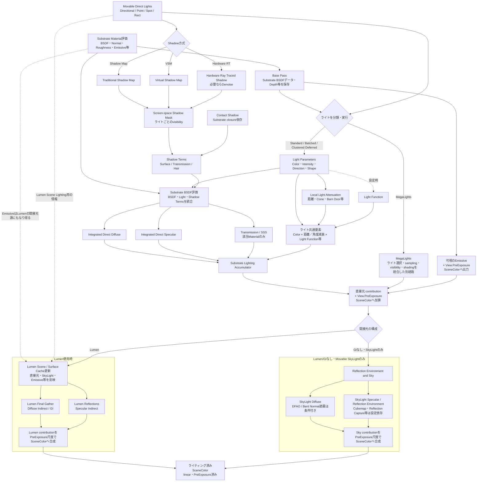
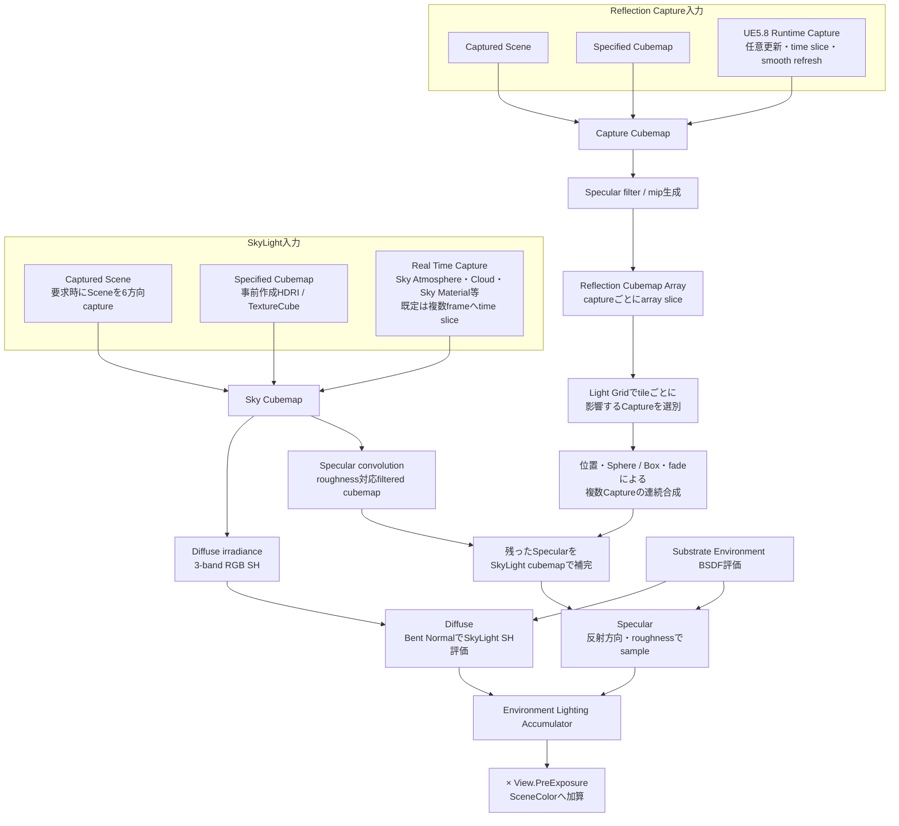
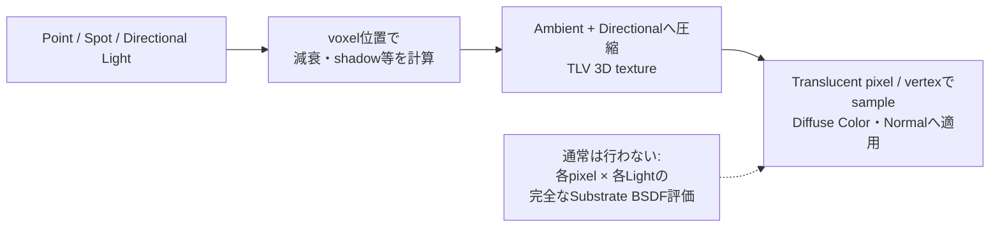
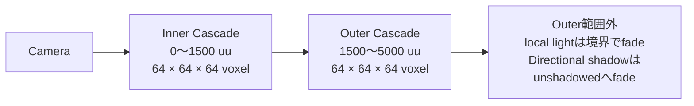
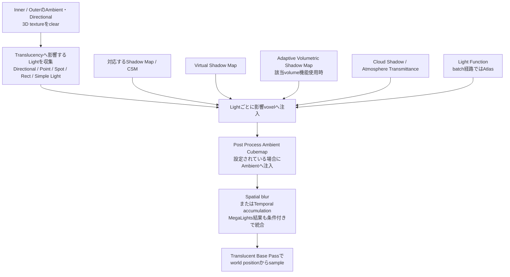
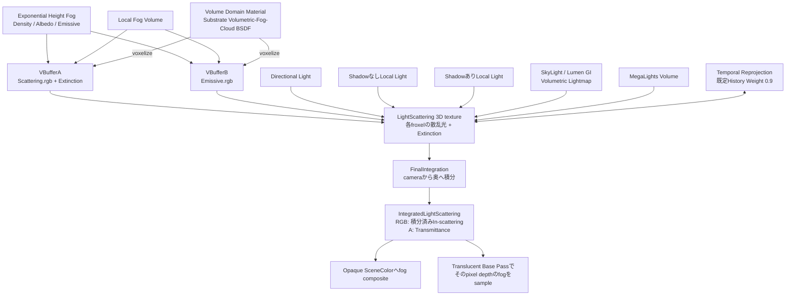
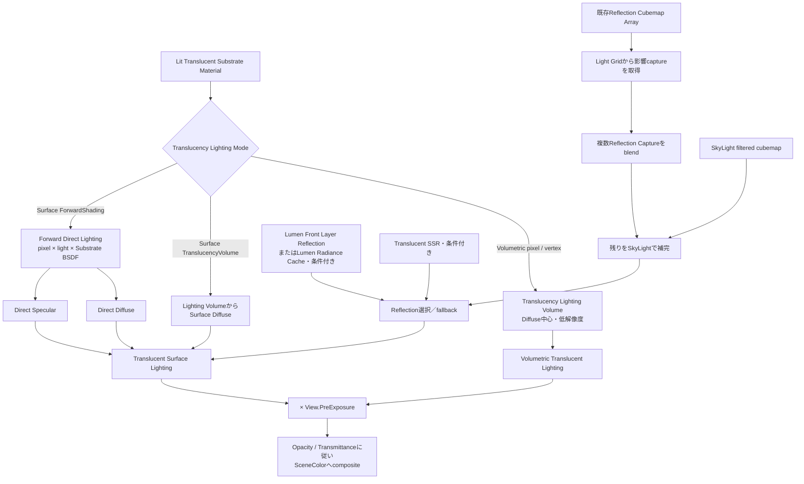

# UE 5.8 HDR出力パイプライン Q&A

## 調査条件

- UE実装: `C:\work\unreal\UnrealEngine-release`（5.8.0）
- 主対象: デスクトップDeferred Renderer、Standard ACES 2.0、Windows/D3D12
- Mobile、Scene Capture、Movie Render、各コンソール固有RHIは分岐が異なる。

## 出力までの全体図



### Lighting詳細図

この図は、不透明オブジェクトを描画するデスクトップDeferred Renderer、Substrate、Movableライトを前提とする。静的／Stationaryライト、Lightmass、Forward、Mobile、Translucency、ポストプロセスは含めない。



この図の縦方向は、主としてSceneColorへ結果を合成する順序を示す。Lumen Scene LightingやFinal Gatherの計算は非同期でBase Passや直接光と重なる場合があるため、GPU上の計算開始順を厳密に直列化した図ではない。通常のSceneColor合成では、Movableライトの直接光より後にLumenのDiffuse Indirect等を合成する。

Directional、Point、Spot、Rectは連続する4工程ではない。ライトは機能と描画方式に応じて分類される。通常のDeferred Lightでは、Traditional Shadow Map、Virtual Shadow Map、Hardware Ray Traced Shadow等から画面空間のShadow Maskを作り、Substrateが利用する`SurfaceShadow`、`TransmissionShadow`等のShadow Termsへ変換する。Ray Traced Shadowは必要に応じてdenoiseした結果をShadow Maskとして渡す。

SubstrateではShadow Mask画像を完成後のSceneColorへ重ねるのではない。材質BSDF、ライト方向・形状、Shadow Termsを`SubstrateEvaluateBSDFCommon()`へ渡し、closureごとのDirect Diffuse、Direct Specular、Transmission等を評価する。通常の不透明表面は概念的に`BSDF response × Shadow visibility`と考えられるが、Subsurface、Transmission、Hair、Contact Shadow等では影の扱いが異なるため、実装上はShadow TermsをBSDF評価へ含めている。

距離／Cone等のLocal Light AttenuationはShadow visibilityとは別の`LightMask`であり、Light ColorやLight Function等と共通倍率を構成する。これをBSDF評価で得たDiffuse／Specular等とLighting Accumulatorで統合し、`View.PreExposure`尺度でSceneColorへ加算する。

MegaLightsはこの通常Deferred Lightの直列手順をそのまま使うpassではなく、ライト選択、sampling、visibility判定、shadingと蓄積を統合する別経路なので、図では分岐させている。

根拠:

- `Engine/Source/Runtime/Renderer/Private/ShadowRendering.cpp:2262-2363,2468-2512`
- `Engine/Source/Runtime/Renderer/Private/LightRendering.cpp:1787-1805,2024-2120,2164-2281`
- `Engine/Shaders/Private/DeferredLightingCommon.ush:90-149,227-243`
- `Engine/Shaders/Private/Substrate/SubstrateDeferredLighting.ush:59-105,115-225`

「GIなし・SkyLightのみ」は、Lumen等の動的GIを使わないという意味である。SkyLight Diffuse自体は環境から来る間接照明なので、物理的な意味で間接光が完全にゼロという意味ではない。Reflection Capture、SSR等を併用するかによってSpecular側の経路は変化する。

### SkyLight／Reflection Captureの生成と合成

SkyLightとReflection Captureはどちらもcubemapを入力にできるが、デスクトップDeferredでは用途が異なる。SkyLightはDiffuse環境光とSpecular環境光の両方を供給し、Reflection Captureは基本的に局所的なSpecular IBLを供給する。



SkyLightのCaptured Scene／Specified Cubemapでは、cubemapのmip生成後に`ComputeDiffuseIrradiance()`から`FSHVectorRGB3`を生成する。Real Time Captureでは`ComputeSkyEnvMapDiffuseIrradianceCS`がGPU上でSHを生成する。シェーダーは`GetSkySHDiffuse(BentNormal)`でDiffuse環境光を復元する。SpecularにはSHではなく、roughnessに対応したfiltered cubemapのmipを使う。

Reflection CaptureはSphere／Boxごとのfiltered cubemapを`Reflection Cubemap Array`へ格納する。各captureの位置、半径、形状、brightness、array index等は別のcapture dataとして保持される。Light Gridからpixelのtileに影響するcaptureだけを取得し、Box／Sphereのparallax correction後に対応sliceとroughness mipをsampleする。

複数captureは単純な「最も近い2枚の正規化lerp」ではない。大きなcaptureから小さな局所captureへ順に、距離fade、capture fade、cubemap alphaを使ったunder operatorで合成する。

```text
AccumulatedRGB += CaptureRGB × CaptureAlpha × RemainingAlpha
RemainingAlpha *= 1 - CaptureAlpha
```

最後に残った`RemainingAlpha`をSkyLight Specularで補う。したがって、影響範囲が重なる場所は連続的に変化するが、captureの大きさと順序を持つ階層的な合成である。

デスクトップDeferredのReflection Capture生成では、`FilterReflectionEnvironment(..., nullptr)`とDiffuse SH出力を渡さないため、通常はcaptureごとのDiffuse SHを作らない。Reflection Captureの低mipからDiffuseを得る条件付き経路はMobile等にはあるが、今回の対象外である。

Lumen使用時は、SkyLightがLumenのDiffuse環境へ入り、SkyLight cubemapとReflection CaptureはLumen Reflectionのfallback／補完として使われ得る。そのためLumen経路では両者をSceneColorへ常に独立加算するとは限らない。

根拠:

- `Engine/Source/Runtime/Renderer/Private/ReflectionEnvironmentCapture.cpp:546-658,2311-2631,2820-2944`
- `Engine/Source/Runtime/Renderer/Private/ReflectionEnvironmentRealTimeCapture.cpp:40-73,343-430,1096-1173,1227-1400`
- `Engine/Shaders/Private/ReflectionEnvironmentShared.ush:81-120`
- `Engine/Shaders/Private/ReflectionEnvironmentComposite.ush:12-260`
- `Engine/Shaders/Private/Substrate/SubstrateLightingCommon.ush:177-212`

### Lit TranslucencyのLighting Mode

次はデスクトップDeferred Renderer上のLit Translucencyを対象とする。TranslucentはOpaqueのGBufferへ書いて後からDeferred Lightingするのではなく、基本的にTranslucent Base Pass内のforward系shaderでライティングし、Opacity／Transmittanceに従って既存SceneColorへ合成する。

| Lighting Mode | 直射光 | Normalの利用 | Direct Specular | Reflection Capture／SkyLight Specular |
|---|---|---|---|---|
| Volumetric NonDirectional | Translucency Lighting Volumeをpixelでsample | しない | なし | 通常なし |
| Volumetric Directional | 方向情報付きLighting Volumeをpixelでsample | する | なし | 通常なし |
| Volumetric PerVertex NonDirectional | Lighting Volumeをvertexでsampleしpixelへ補間 | しない | なし | 通常なし |
| Volumetric PerVertex Directional | 方向情報付きLighting Volumeをvertexでsampleしpixelへ補間 | する | なし | 通常なし |
| Surface TranslucencyVolume | SurfaceとしてLighting Volumeをpixelでsample。結果は低解像度でぼける | する | ローカルライトの正確なhighlightはなし | あり。複数captureをblend可能 |
| Surface ForwardShading | Light Gridから各ライトをpixel単位でforward評価 | する | あり | あり。複数captureをblend可能 |

#### TLVは直射光にも使うのか

**使う。TLVは反射光専用ではない。** `Affect Translucent Lighting`が有効なMovableのDirectional／Point／Spot／Rect Lightなどの直接光を、距離・角度減衰、shadow、Light Function等とともにvoxelへ注入する。ただし、Point Lightの直接光の扱いはLighting Modeで異なる。

| Lighting Mode | Point／Spot等の直接光 |
|---|---|
| Volumetric NonDirectional／Directional | Lightごとの寄与を先にTLVへ注入する。半透明pixelではTLVをsampleし、元のLightをper-pixelで再評価しない |
| Volumetric PerVertex NonDirectional／Directional | TLVをvertexでsampleしてpixelへ補間する。Lightごとのper-pixel BSDF評価はしない |
| Surface TranslucencyVolume | TLVからDirect Diffuseを近似する。通常のLocal Lightによる鋭いDirect Specularは得られない |
| Surface ForwardShading | Light Grid内のLightを列挙し、pixel・Substrate BSDF・Light単位でDiffuse／Specularを直接評価する |

TLVへの注入時にはvoxel位置でLightの距離、Spot cone、shadow等を計算する。しかしMaterial固有のNormal、Roughness、F0はまだ分からないため、特定surfaceの完全なBSDF shadingを済ませるわけではない。Lightの色と方向を低周波表現へ圧縮し、後でMaterialがsampleする。



Directional modeではTLVから復元した近似SHをMaterial Normalに対して評価するため、NormalによるDiffuseの向きは反映される。しかし、一灯ごとに`L`、`V`、half vector、Roughness、Fresnelを使う完全なBRDF評価ではない。NonDirectional modeはNormalも使わない。

Surface ForwardShadingは別である。`SubstrateForwardLighting.ush`はDirectional Lightを個別評価し、Culled Light GridのLocal Lightをループして、各Lightの距離減衰、shadow、IES等を求め、現在のSubstrate BSDFを評価する。正確なPoint／Spot LightのSpecular highlightが必要なら原則こちらを使う。

TLVへ注入される直接光、Lumen Translucency GI、SkyLight、Reflection Captureは別経路であり、最終結果で合成される。

#### Substrate Translucencyの「Shading Model」

Substrateでは次の3軸を分ける必要がある。

1. **BSDF node／Shading Model**：Materialが光へどう応答するか。
2. **Translucency Lighting Mode**：直接照明をTLVで近似するか、Lightごとにforward評価するか。
3. **Blend Mode**：foregroundと背後のSceneColorをcoverage／transmittanceでどう合成するか。

同じSlab BSDFでもLighting Modeを変えれば照明の取得方法が変わる。「Translucent専用Shading ModelがLighting Modeごとにある」わけではない。

##### UE5.8の主なSubstrate BSDF node

| BSDF node | 主な役割 | Translucencyとの関係 |
|---|---|---|
| Substrate Slab | 一般surface。Diffuse、F0／F90、Roughness、Anisotropy、SSS／transmission、fuzz、第二specular lobe等 | ガラス、プラスチック、薄膜、半透明surfaceの基本。複数Slabをlayer／mix可能 |
| Substrate Simple Clear Coat | baseと単純なclear-coat lobeを一つにした軽量BSDF | コーティングsurface向け。複雑なlayerより機能を限定した近似 |
| Substrate Volumetric-Fog-Cloud BSDF | Albedo、Extinction、Emissive、phase anisotropy等を持つparticipating media | Volumetric Fog／Cloud等のvolume向け。通常のsurface TLV Lighting Modeとは同一視しない |
| Substrate Unlit BSDF | 非照明のEmissiveとTransmittance／Opacity | LightやTLVを評価しない |
| Substrate Hair BSDF | 毛髪繊維の専用散乱 | Hair rendering向け。一般のガラス／particle用ではない |
| Substrate Eye BSDF | cornea／iris等の眼球専用応答 | Eye rendering専用 |
| Substrate Single Layer Water BSDF | 水面と水中mediumの散乱・吸収 | 専用Single Layer Water passを使い、通常のLit Translucency／TLV分類とは別 |
| Substrate Toon BSDF | 非写実的なtoon応答 | UE5.8ではExperimental |

`Substrate Shading Models` nodeはlegacy Shading ModelをSubstrateへ変換する互換入口で、独立した新BSDFではない。Default Lit、Thin Translucent、Clear Coat、Subsurface、Cloth等は内部で主にSlabとfeatureの組み合わせへ変換され、Hair、Eye、Single Layer Waterは専用BSDF typeになる。

##### Thin TranslucentとSlab

legacy `Thin Translucent`は厚みのない着色透過surface向けである。Substrate変換では独立した`SUBSTRATE_BSDF_TYPE_THIN_TRANSLUCENT`ではなくSlabへ変換され、`TransmittanceColor`と`ThinTranslucentSurfaceCoverage`を使う。

legacy Thin Translucentには、Translucent Blend、Surface ForwardShading、他Shading Modelと併用不可、Thin Translucent Material Output必須というソース上の制約がある。一方、native SubstrateではSlabのMFP、transmittance、layeringによって透過coat等を構築できるため、「Thin Translucentだけが透けるSubstrate Shading Model」ではない。

##### SubstrateのTranslucent Blend Mode

| Blend Mode | 合成上の意味 |
|---|---|
| Translucent - Grey Transmittance | 背景をRGB共通の透過率で減衰してforegroundを合成。旧Translucent相当 |
| Translucent - Colored Transmittance | 背景をRGB別の透過率で減衰。着色ガラス向けでdual-source blendingを要求 |
| Colored Transmittance Only | 通常の反射色より、背景へ色付きtransmittanceを掛けることが主目的。旧Modulate相当 |

これらはBSDFではなくframebufferへの合成規則であり、TLVかSurface ForwardShadingかを直接決めない。

根拠:

- `Engine/Shaders/Private/BasePassPixelShader.usf:250-399,1391-1450,1612-1619`
- `Engine/Shaders/Private/Substrate/SubstrateForwardLighting.ush:390-605`
- `Engine/Source/Runtime/Engine/Public/Materials/MaterialExpressionSubstrate.h:56-824`
- `Engine/Source/Runtime/Engine/Private/Materials/MaterialExpressionSubstrate.cpp:646-763`
- `Engine/Source/Runtime/Engine/Private/Materials/MaterialShared.cpp:6440-6464`
- `Engine/Source/Runtime/Engine/Classes/Engine/EngineTypes.h:245-258,709-727`

#### 3D Translucency Lighting Volumeとは

3D Translucency Lighting Volume（以下TLV）は、カメラ周辺の空間を低解像度のvoxelへ分割し、Translucent Materialで使う照明をあらかじめ蓄積する3D lighting cacheである。Opaque用のGBufferでもReflection Captureでもなく、煙、particle、半透明surfaceを多数描画するときに、各pixelで全ライトを再評価するコストを避けるために使われる。

```text
複数のMovable Light
  × 距離・角度減衰
  × 対応するshadow
  × Light Function等
        ↓
カメラ周辺の3D voxelへ照明を注入
        ↓
Ambient / Directional 3D texture
        ↓
Translucent objectのworld positionでsample
        ↓
MaterialのDiffuse lightingとして使用
```

TLVは、Translucent geometryそのものをvoxel化したものではない。各voxelへ「この空間位置に半透明物体が存在した場合、どの方向からどれだけ光を受けるか」という照明情報を保存する。したがって同じvoxel内にある複数のparticleや半透明surfaceは、同じ近似照明を共有する。

##### 空間配置と2つのcascade

TLVはworld全体を固定volumeで覆わず、Viewごとにカメラを追従する2つのcascadeを作る。



既定値は次である。

| CVar | 既定値 | 意味 |
|---|---:|---|
| `r.TranslucencyLightingVolume.Dim` | 64 | 各cascadeの一辺のvoxel数 |
| `r.TranslucencyLightingVolume.InnerDistance` | 1500 | Inner cascadeの終端距離 |
| `r.TranslucencyLightingVolume.OuterDistance` | 5000 | Outer cascadeの終端距離 |
| `r.TranslucencyLightingVolume.Blur` | 1 | spatial filterの有効化 |
| `r.TranslucencyLightingVolume.Temporal` | 0 | temporal accumulationの有効化 |

`uu`は通常のUE world unitであり、既定スケールでは1 uuを1 cmとして扱うことが多いが、プロジェクト側でスケールを変更できる。

各cascadeは単純なカメラ中心の一定サイズcubeではない。カメラfrustumのnear／far側頂点をもとにbounding sphereを計算し、そのsphereを囲むaxis-aligned boxを3D texture領域にする。既定ではFOV変化への追従を無効化し、カメラ移動時にはvolume中心をvoxel幅の倍数へsnapして、照明がゆっくりcrawl／shimmerするのを抑える。

InnerとOuterは別々の3D textureを持つ。Material shaderはworld positionから両方のUVWを計算し、Inner境界付近でOuterとの間を連続的にblendする。

```text
InnerLighting = sample(InnerVolume, InnerUVW)
OuterLighting = sample(OuterVolume, OuterUVW)

Lighting = lerp(
    OuterLighting,
    InnerLighting,
    Inner境界から求めたFinalLerpFactor
)
```

Innerは狭い範囲へ同じ64³ voxelを使うため比較的細かく、Outerは広範囲を覆う代わりに1 voxelのworld sizeが大きくなる。

##### 作成される3D texture

各cascadeについて、少なくとも次の2枚を作る。

| 3D texture | 形式 | 内容 |
|---|---|---|
| `TranslucentVolumeAmbient` | `PF_FloatRGBA` | RGBの無方向成分と、圧縮表現に必要な補助値 |
| `TranslucentVolumeDirectional` | `PF_FloatRGBA` | 主な入射方向を表す圧縮された方向成分 |

これは各voxelへ完全なcubemapを置く仕組みではない。ライトの色と方向を`AccumulateSHLighting()`で圧縮し、sample時にAmbient成分とDirectional成分から近似的な2-band SHを復元する。

```text
Voxel lighting
├─ Ambient RGB
└─ 圧縮されたDirectional Vector
        ↓
ReconstructSHCoefficients()
        ↓
近似的なTwo-band RGB SH
```

Directional成分は完全なRGB SH係数ではない。復元時にはAmbient colorを正規化し、monochromeなDirectional係数へ色を戻す近似を行う。そのためメモリとsampleコストは小さいが、複数方向から来る高周波な照明や鋭い境界を正確には保持できない。

MegaLightsがTLVを使ってSurface ForwardShadingを補助する場合には、近似Specular方向用の`TranslucentVolumeSpecularDirection`も条件付きで作られる。形式は`PF_A2B10G10R10`である。これは通常のReflection CaptureによるSpecular IBLとは別物で、TLV内の代表的なライト方向からDirect Specularを近似するための補助情報である。

既定64³、2 cascade、Ambient＋DirectionalをRGBA16Fと仮定すると、主要volumeだけで概算8 MiB／primary viewになる。

```text
64³ voxel
× 2 texture
× 2 cascade
× 8 byte（RGBA16F）
≈ 8 MiB
```

これは主要textureだけの概算であり、RDG管理、履歴、filter用一時texture、stereo／multi-view、MegaLights用textureは含まない。

##### 何をもとに照明を注入するか

フレームごとの基本順序は次である。



各voxelでは、おおむね次を計算する。

```text
VoxelLighting
  = LightColor / PI
  × LocalLightAttenuation
  × ShadowFactor
  × LightFunction
  × CloudShadow（Directional、条件付き）
  × AtmosphereTransmittance（条件付き）
```

Local Lightは距離、半径、Spot cone等で影響voxelを制限する。Directional Lightはvolume全体へ作用する。Shadowについては通常Shadow Map／CSM、VSM等をvoxel位置で評価する。通常のHardware Ray Traced Shadowをそのまま全voxelへtraceして注入する共通経路ではない。MegaLightsがTLVを生成する場合は、MegaLights側のvolume sampling／visibility経路が別に存在する。

Light Componentの`Affect Translucent Lighting`に相当する条件を満たすライトだけが対象になる。Simple Lightはまとめて注入でき、通常ライトも対応条件ではbatch compute pathを使う。`r.TranslucencyLightingVolume.MarkVoxels`を有効にすると、実際にTranslucent描画から参照されるvoxelをmarkし、更新対象を絞る実装もあるが既定は無効である。

##### SkyLight、Ambient Cubemap、Lumen GIとの違い

TLVを「Translucency用のすべての間接光が入ったvolume」と考えるのは正確ではない。

- Movable Light等の直接光：TLVへ注入される。
- Post ProcessのAmbient Cubemap：`ContributingCubemaps`からTLV Ambientへ注入される。
- SkyLight Diffuse：Material側のSky Lighting経路から加わる。単純にTLVへSkyLight SHを焼き込むだけではない。
- Lumen Translucency GI：TLVとは別の`Lumen Translucency GI Volume`を生成し、Material shaderからsampleする。
- Reflection Capture／SkyLight Specular：Surface系TranslucencyがReflection Cubemap Array等から別途評価する。
- Volumetric Lightmap／precomputed indirect lighting：利用条件に応じて別のindirect lighting経路から加わる。

```text
Lit Translucencyの最終照明
├─ TLV
│   └─ 主に低解像度化したDirect Diffuse
├─ SkyLight / precomputed indirect
├─ Lumen Translucency GI Volume（Lumen時）
├─ Reflection Capture / SkyLight Specular（Surface系）
├─ SSR / Lumen Front Layer Reflection（条件付き）
└─ Emissive
```

Lumen shaderのコメントでも、`Lumen Translucency GI Volume`は「Lumen Dynamic GI + shadowed Skylight」とされ、Two-band SHとして取得される。名称にVolumeを含むが、従来の`Translucency Lighting Volume`とは別resource／別目的である。

##### Material shaderでの利用

Pixel評価モードでは、Translucent pixelのworld positionをInner／OuterのUVWへ変換し、3D textureをtrilinear sampleする。PerVertexモードでは同じ操作をvertex shaderで行い、結果をraster interpolationしてpixel shaderへ渡す。

NonDirectionalではAmbient成分だけを使う。

```text
Ambient voxel lighting
× Material Diffuse Color
```

DirectionalではAmbient＋Directionalから近似SHを復元し、Material Normalに対して評価する。

```text
Reconstructed Two-band SH
・ Material Normal
× Material Diffuse Color
```

このためDirectional modeはNormalの向きによる明暗を表現できるが、voxel内の照明は共有されるため、Opaqueのpixel単位Deferred Lightingほど正確ではない。

##### なぜぼけるのか

主な理由は次のとおり。

1. 64³という低解像度で広い3D空間を覆う。
2. Inner／Outer cascade間をblendする。
3. 3D textureをtrilinear sampleする。
4. 既定でspatial blurを行う。
5. ライト方向を圧縮SHで保持する。
6. temporal filterを使う場合は履歴とのblendで応答が遅れる。

解像度`Dim`を2倍にすると一辺だけでなく3次元すべてが増えるため、voxel数と主要メモリ／処理量は概ね8倍になる。Inner／Outer Distanceを大きくすると範囲は広がるが、同じDimなら1 voxelが大きくなって精度が下がる。

##### 適する用途と適さない用途

適する用途:

- 煙、埃、霧状particle
- 半透明effectを大量に描く場面
- 正確な局所Specularより処理速度を優先する表現
- 低周波で滑らかな照明変化

適さない用途:

- 鏡面に近いガラス
- 小さなPoint Lightの鋭いhighlight
- 細いshadow境界
- Reflection Captureの鮮明な映り込み
- pixel単位で正確な複数ライト評価が必要なsurface

後者にはSurface ForwardShading、Reflection Capture／SSR、Lumen Front Layer Reflection等を検討する。

TLVの確認用CVarとして`r.TranslucencyLightingVolume.Visualize`があり、`r.TranslucencyLightingVolume.VisualizeCascadeIndex`で表示cascadeを選択できる。

根拠:

- `Engine/Source/Runtime/Renderer/Private/TranslucentLighting.cpp:101-268,271-384`
- `Engine/Source/Runtime/Renderer/Private/TranslucentLighting.cpp:1241-1408,1428-1500`
- `Engine/Source/Runtime/Renderer/Private/TranslucentLighting.cpp:1771-2096,2418-2600,3023-3102`
- `Engine/Shaders/Private/TranslucentLightInjectionShaders.usf:136-297,309-429`
- `Engine/Shaders/Private/TranslucencyVolumeCommon.ush:11-120`
- `Engine/Shaders/Private/BasePassVertexShader.usf:146-183`
- `Engine/Shaders/Private/BasePassPixelShader.usf:249-397,401-445`

#### Volumetric Fogの生成・照明・合成経路

Volumetric Fogは3D Translucency Lighting Volume（TLV）とは別resourceである。TLVが「Translucent Materialからsampleする近似照明cache」であるのに対し、Volumetric Fogはcamera frustumを3D froxelへ分割し、participating mediumの散乱・吸収を視線方向へ積分する。



##### froxel grid

TLVのInner／Outer cascadeとは異なり、Volumetric Fogは画面XYとcamera depth Zで構成されるcamera-frustum-aligned gridを使う。各cellを本節ではfroxelと呼ぶ。

| CVar | 既定値 | 意味 |
|---|---:|---|
| `r.VolumetricFog.GridPixelSize` | 16 | XY方向で1 cellが担当するpixel幅 |
| `r.VolumetricFog.GridSizeZ` | 64 | depth方向のslice数 |
| `r.VolumetricFog.DepthDistributionScale` | 32 | Z sliceの非線形分布を調整 |
| `r.VolumetricFog.TemporalReprojection` | 1 | 前frameのvolumeを再投影 |
| `r.VolumetricFog.Jitter` | 1 | temporal supersampling用jitter |
| `r.VolumetricFog.HistoryWeight` | 0.9 | 現frameと履歴のblend比 |
| `r.VolumetricFog.HistoryMissSupersampleCount` | 4 | 履歴が使えないcellのsample数 |

XY解像度はおおむねview解像度を16 pixel単位へ分割して決まる。Zは既定64 sliceで、world distanceの等間隔ではなくcamera depthに対して非線形に配置される。近距離側が比較的細かく、遠距離ほど1 froxelのworld sizeが大きくなる。

##### medium属性の作成

最初に`MaterialSetupCS`が、Exponential Height Fogと条件付きLocal Fog Volumeからglobalなmedium属性を作る。その後、Material Domainが`Volume`のparticle／primitiveを`VoxelizeVolumePrimitives`で同じVBufferへ加算する。

| Resource | 格納内容 |
|---|---|
| `VBufferA.rgb` | scattering coefficient。基本形は`Albedo × Extinction` |
| `VBufferA.a` | extinction coefficient |
| `VBufferB.rgb` | emissive。`r.VolumetricFog.Emissive`が有効な場合 |

Substrateでは`Substrate Volumetric-Fog-Cloud BSDF`がVolume Domain Material用の入力となる。Volumetric Fog voxelizerがこのBSDFから明示的に読み取る値はAlbedo、Extinction、Emissiveである。

```text
Scattering = Albedo × Extinction

VBufferA += float4(Scattering, Extinction)
VBufferB += float4(Emissive, 0)
```

これはsurface SlabのようなBRDFをLightごとに評価する処理ではなく、mediumの係数を3D gridへ書く処理である。また通常のVolumetric Fog経路でLight scatteringへ渡される`PhaseG`は、Exponential Height Fogの`VolumetricFogScatteringDistribution`から取得される。少なくとも確認したvoxelizerは各Volume Materialのphase anisotropyをVBufferへ格納していないため、「各Volume Materialが独立したphase functionをfroxelへ保存する」とは記述できない。

##### Lightの評価

Volumetric Fogは反射光だけでなく、直接光をfroxel単位で評価する。概念式は次のとおり。

```text
InScattering
  = LightColor
  × LightAttenuation
  × ShadowFactor
  × LightFunction
  × VolumetricScatteringIntensity
  × PhaseFunction
  × MediumScatteringCoefficient
```

Light Component側の`Volumetric Scattering Intensity`が小さい、または0なら、そのLightはfogへほとんど、またはまったく寄与しない。

Directional Lightは、選択された`SelectedForwardDirectionalLightProxy`をmainの`LightScatteringCS`で評価する。Light color／direction、volumetric scattering intensity、static／dynamic shadow、VSM、条件付きray traced shadow volume、cloud shadow、Light Function、phase functionが入力になる。通常経路で主要なDirectional Lightとして扱われるのは、この選択された1灯である。

ShadowなしPoint／Spot／Rect LightはLight Gridから列挙され、`LightScatteringCS`内でまとめてforward評価される。froxel位置で距離減衰、inverse-square falloff、Spot cone、Rect／Capsule近似、Light Function、phase functionを計算する。

Shadow付きLocal Lightは既定で別passから`LocalShadowedLightScattering`へ先に描かれ、main passがこれを加算する。対応するvisibility sourceにはProjected Shadow、Static Shadow Depth Map、VSM、条件付きray traced shadowがある。`r.VolumetricFog.InjectShadowedLightsSeparately`の既定値は1である。

`r.VolumetricFog.InjectRaytracedLights`の既定値は0である。有効時はshadow付きLocal LightをRay Generation Shaderでvolumeへ注入し、選択Directional Lightには3D ray-traced shadow volumeを作る専用経路がある。したがってHardware Ray Traced Shadowが常にVolumetric Fogへ反映されるわけではない。

MegaLights使用時は、先に作られた`MegaLightsVolume`もLightScatteringへ加算される。

##### SkyLight、Lumen GI、precomputed lighting

Lumen Translucency GI Volumeが存在する場合、Volumetric Fogもこの別resourceをsampleする。shaderコメント上の内容は`Lumen Dynamic GI + shadowed Skylight`であり、Two-band SHをcamera方向とphase functionに対応するzonal harmonicへ評価してin-scatteringへ加算する。これは従来のTLVではない。

Lumen GIを使わない場合はSkyLightのDiffuse environment／Sky SHを評価し、条件が整えばDistance Field Sky Occlusionを適用する。Static Lighting Scattering Intensityが有効ならVolumetric Lightmapのirradiance SHも加算する。

```text
Lumen構成:
Directional / Local Light
+ Lumen Dynamic GI
+ shadowed SkyLight

GIなし・SkyLightのみ:
Directional / Local Light
+ SkyLight
+ 条件付きDistance Field Sky Occlusion
```

##### LightScatteringとPreExposure

mediumと照明を組み合わせた結果を`LightScattering` 3D textureへ書く。

```text
PreExposedScatteringAndExtinction =
    float4(
        View.PreExposure
        × (LightScattering × MaterialScattering + MaterialEmissive),
        Extinction
    )
```

RGBのscattering／emissiveは`View.PreExposure`されるが、extinctionはPreExposureしない。Shadowed Local LightやMegaLightsの中間volumeはmain pass内で一度PreExposureを戻してから統合される。前frame historyも前回と現在のPreExposure差を補正してからblendされる。

##### Temporal Reprojection

低いfroxel解像度を補うため、temporal reprojectionは既定で有効である。毎frame jitterした位置を評価し、world positionを前frame volumeへ再投影する。履歴が有効なら既定0.9でblendし、camera cutやprevious transform resetでは破棄する。履歴が得られないfroxelは既定4 sampleでsupersampleする。

これは滑らかで安定したfogを作る一方、急激に変化するflash lightや高速移動するLightで残像が見える理由にもなる。

##### camera ray方向のFinalIntegration

`FinalIntegrationCS`は各XY列についてcamera側からZ sliceを順番に積分する。

```text
StepTransmittance = exp(-Extinction × StepLength)

AccumulatedLighting +=
    ScatteringIntegratedOverSlice
    × AccumulatedTransmittance

AccumulatedTransmittance *= StepTransmittance
```

その結果が`IntegratedLightScattering`である。

| channel | 内容 |
|---|---|
| RGB | cameraからそのsliceまでに積分したin-scattering |
| A | cameraからそのsliceまで残るtransmittance |

##### SceneColorとTranslucencyへの適用

scene depthからvolume UVを求め、対応する深度の`IntegratedLightScattering`をsampleする。基本合成は次の形である。

```text
FoggedSceneColor
  = FogInScattering
  + SceneColor × FogTransmittance
```

既存のExponential Height Fog結果との合成はshader上で次の形になる。

```text
Combined.rgb = VolumetricFog.rgb + HeightFog.rgb × VolumetricFog.a
Combined.a   = VolumetricFog.a × HeightFog.a
```

`IntegratedLightScattering.rgb`はPreExposure済みなので、汎用fog値として扱う`CombineVolumetricFog()`では`OneOverPreExposure`で戻し、呼び出し側のSceneColor／fog合成規則へ合わせる。

Opaqueにはscreen-space fog compositeから適用される。Lit Translucencyでは`BasePassPixelShader.usf`内から、そのtranslucent pixelのdepthに対応するVolumetric Fogをsampleして適用する。したがってVolumetric FogはOpaqueへ一度焼き込むだけではなく、Translucency自身も自身のdepthに応じたfogを参照する。

##### TLVとの比較

| 項目 | 3D Translucency Lighting Volume | Volumetric Fog |
|---|---|---|
| 主目的 | Translucent Material用の近似照明cache | participating mediumの散乱・吸収 |
| 空間構造 | Inner／Outerの2 cascade | camera frustumに沿ったfroxel grid |
| 保存するもの | 圧縮した照明方向・強度 | scattering、extinction、emissive、積分済みtransmittance |
| Material | Surface／Volumetric Lit Translucency | Volume Domain Material |
| Light結果 | Materialが後でDiffuseへ適用 | medium係数と掛け、camera ray方向へ積分 |
| Temporal | TLVでは既定無効 | Volumetric Fogでは既定有効 |

`Substrate Volumetric-Fog-Cloud BSDF`はTLVへ照明を書き込むBSDFではなく、Volumetric FogのVBufferへmedium属性を書き込むためのVolume Domain向けBSDFである。

根拠:

- `Engine/Source/Runtime/Renderer/Private/VolumetricFog.cpp:88-219,880-1090,1499-2040`
- `Engine/Source/Runtime/Renderer/Private/VolumetricFogVoxelization.cpp:177-384,640-781`
- `Engine/Shaders/Private/VolumetricFog.usf:46-295,422-568,844-1196,1201-1246`
- `Engine/Shaders/Private/VolumetricFogVoxelization.usf:29-68,295-344`
- `Engine/Shaders/Private/HeightFogCommon.ush:535-589`
- `Engine/Shaders/Private/BasePassPixelShader.usf:1549-1559`
- `Engine/Source/Runtime/Engine/Public/Materials/MaterialExpressionSubstrate.h:507-569`

#### Volumetric NonDirectional

煙、埃、炎などのvolume表現向けである。ライトはカメラ周辺の3D Translucency Lighting Volumeへ注入され、各pixelがvolumeをsampleする。方向性を使わないためMaterial Normalは照明方向へ影響しない。もっとも低コストだが、ライト個別の鋭いSpecular highlightやReflection Captureによる表面反射には向かない。

#### Volumetric Directional

同じTranslucency Lighting Volumeから方向情報も復元し、Material Normalを使ってDiffuse応答を計算する。粒子のdefault tangent spaceはカメラ方向を向くため、球状particleではSpherical Particle Normals等が必要になる場合がある。Direct Specularと表面IBL反射を目的とするモードではない。

#### Volumetric PerVertex NonDirectional

Volumetric NonDirectionalと同じLighting Volumeをvertex shader側で評価し、結果をpixelへ補間する。pixel shader負荷は低いが、頂点密度が低いmeshや大きなparticleでは照明変化が粗くなる。Lighting Volumeの範囲制限も受ける。

#### Volumetric PerVertex Directional

Volumetric Directionalをvertex単位で評価する。Normalを考慮する方向性Diffuseを持つが、結果はvertex間で補間される。遠距離ではDirectional Lightがunshadowedになる場合があることが列挙型コメントに明記されている。

#### Surface TranslucencyVolume

ガラスや水面状のsurface向け低コストモードで、直射光のDiffuseはTranslucency Lighting Volumeから取得する。Volumeへ蓄積された照明を使うため、範囲が限定され、影や照明境界がぼける。ローカルライトごとの正確なDirect Specular highlightは計算しない。

一方、環境Specularは別経路で評価できる。Deferred RendererではSurface TranslucencyVolumeとSurface ForwardShadingの両方が、Light Gridと同じReflection Cubemap Arrayを参照し、複数Reflection Captureをblendした後、SkyLightで残りを補う。

#### Surface ForwardShading

もっとも高品質で高コストなsurface modeである。各Translucent pixelについてLight Gridから影響するDirectional／Point／Spot／Rect Lightを取得し、Substrate forward BSDFでDirect DiffuseとDirect Specularを評価する。

ただしUE5.8ではMegaLights使用時など、Front Layer Direct LightingまたはTranslucency Lighting Volumeへ処理を移す分岐がある。そのため、すべてのライトが常に同じpixel shader内で逐次評価されるとは限らない。



Surface系のReflection Captureは新しいIBLをTranslucent objectごとに生成するのではない。Opaque環境光と同じcubemap array、capture data、Light GridをTranslucent shaderから再利用する。Deferred Renderer上のSurface系Translucencyでは、複数capture blendingが既定の実装経路である。

Surface ForwardShadingの環境反射は、Substrateが求めた反射方向、roughness、Specular WeightでReflection Capture／SkyLightをsampleし、Env BRDFとSpecular Occlusionを適用する。これはライト形状から生じるDirect Specularとは別のIndirect Specularである。

```text
Translucent surface lighting
  = Direct Diffuse
  + Direct Specular
  + Diffuse Indirect
  + Reflection Capture / SkyLight Specular
  + SSRまたはLumen Reflection（条件付き）
  + Emissive
```

Lumen Front Layer Reflectionを有効にした場合は、最前面のTranslucent surface用データを別passで作り、Lumen Reflection textureをTranslucent Base Passからsampleする。これは重なった全透明layerへ同じ品質のLumen Reflectionを作るものではない。有効なFront Layer ReflectionまたはLumen Radiance Cacheがない場合は、Reflection Capture／SkyLightがfallbackになる。

根拠:

- `Engine/Source/Runtime/Engine/Classes/Engine/EngineTypes.h:314-356`
- `Engine/Shaders/Private/BasePassPixelShader.usf:1387-1510`
- `Engine/Shaders/Private/ForwardLightingCommon.ush:137-220,450-585`
- `Engine/Shaders/Private/Substrate/SubstrateForwardLighting.ush:45-360`
- `Engine/Source/Runtime/Renderer/Private/FrontLayerTranslucency.cpp:627-864`

SceneColorとTVへ渡すHDR信号は別物である。

- SceneColor: シーン基準、線形、PreExposure済みの浮動小数点中間画像
- PQ出力: ディスプレイ基準、非線形符号値
- PQはトーンマップではなく、表示輝度を信号へ符号化する関数

図中の「出力先の条件を選択」は画像を生成する独立passの名前ではなく、以降の表示変換へ渡す条件の選択を表す。具体的には出力形式、target peak luminance、出力gamut、最終encodingが決まり、その条件を使ってACES 2.0等のtone/gamut mappingが計算される。

## Q1. UEのライティングはリニアスペースで行われる？

はい。通常のデスクトップレンダリングでは、ライティングは線形RGBのscene-referred値として計算・加算される。sRGBテクスチャはサンプリング時に線形化され、ライト、BRDF、間接光、Emissive等を線形演算した結果がSceneColorへ蓄積される。

ただし全バッファが線形色という意味ではない。GBufferのBase Color等は帯域節約のため量子化・符号化され、Normal、Roughness、Depthはそもそも色ではない。Mobile LDRにも別経路がある。

根拠:

- `Engine/Source/Runtime/Engine/Private/SceneTexturesConfig.cpp:142-175`
- `Engine/Shaders/Private/BasePassPixelShader.usf:2484-2495`
- `Engine/Shaders/Private/DeferredShadingCommon.ush:224-234`

## Q2. 何bitで計算・保持される？

1個のbit数では表せない。シェーダーの算術精度とrender targetの保存形式は別である。

- シェーダー計算: HLSL `float`中心。ただしGPU上の実効精度は型、最適化、hardwareによる。
- SceneColor既定: `PF_FloatRGBA`、RGBA各16-bit float、合計64 bit/pixel。
- Windows製品版のHDR10 backbuffer: RGB各10-bit＋Alpha 2-bit、合計32 bit/pixel。
- Windows EditorのHDR backbuffer既定: FP16 scRGB、合計64 bit/pixel。

`r.SceneColorFormat`の選択肢は次のとおり。

| 値 | 形式 | 合計bit | 備考 |
|---:|---|---:|---|
| 0 | `PF_R8G8B8A8` | 32 | HDRには実用困難とのコード説明 |
| 1 | `PF_A2B10G10R10` | 32 | 10-bit UNORM系 |
| 2 | `PF_FloatR11G11B10` | 32 | RGB float、Alphaなし |
| 3 | `PF_FloatRGB` | 32 | packed float |
| 4 | `PF_FloatRGBA` | 64 | 既定、RGBA16F |
| 5 | `PF_A32B32G32R32F` | 128 | テスト向け |

根拠:

- `Engine/Source/Runtime/Core/Private/HAL/ConsoleManager.cpp:4141-4152`
- `Engine/Source/Runtime/Engine/Private/SceneTexturesConfig.cpp:100-139`
- [Microsoft DXGI formats](https://learn.microsoft.com/en-us/windows/win32/api/dxgiformat/ne-dxgiformat-dxgi_format)

## Q3. SceneColorにはライト値そのものが保持される？

厳密には違う。線形のscene lightingへ`View.PreExposure`を掛けた値が格納される。

```text
SceneColorStored = LinearSceneLighting × PreExposure
```

PreExposureは、非常に大きい／小さい光をFP16 SceneColorの扱いやすい範囲へ収め、overflowと精度低下を抑える。線形性は保たれるが、絶対的なシーン値からは共通倍率でスケール済みである。元の値が必要な処理は概ね`OneOverPreExposure`を掛けて戻す。

根拠:

- `Engine/Shaders/Private/BasePassPixelShader.usf:2484-2495`
- `Engine/Shaders/Private/DeferredShadingCommon.ush:224-234`
- `Engine/Shaders/Private/Histogram.usf:319`

## Q4. Exposureはいつ計算され、いつ掛かる？

Auto ExposureはTonemap前のSceneColorから輝度分布を測定し、Eye Adaptation bufferへGlobal Exposureを計算する。Tonemap shaderはSceneColorのPreExposureを戻してからGlobal Exposureを掛ける。

```text
FinalLinearColor = SceneColorStored
                 × OneOverPreExposure
                 × GlobalExposure
                 × SceneColorTint
                 × VignetteMask
                 × LocalExposure
```

したがって処理は二段構造である。

1. SceneColorへ保存する前に、精度確保用PreExposureを乗算する。
2. Tonemap時にそれを逆算し、表示用Global Exposureを適用する。

Manual Exposureでは現在の固定値をPreExposureへ直接使える。Auto ExposureではPreExposureは通常、前回readbackされたExposureを利用し、TonemapはGPU上のEye Adaptation bufferを読む。両者が違っても`OneOverPreExposure × GlobalExposure`で最終値が補正される。

根拠:

- `Engine/Source/Runtime/Renderer/Private/PostProcess/PostProcessEyeAdaptation.cpp:1504-1608`
- `Engine/Shaders/Private/PostProcessTonemap.usf:311-313,413-437,523-528`

## Q5. Standard ACES 2.0 ＝ Tonemap？

利用者視点では「UEで選べるtone/display mapping方式の1つ」と考えてよいが、完全な同義語ではない。

- Standard ACES: Tonemapping Method
- ACES 2.0: Output TransformのVersion
- SDR/PQ/scRGB: Display Output

ACES 2.0 Output Transformは単一のS字カーブではなく、tone scale、明るい高彩度色のgamut mapping、出力色域・表示条件への変換を含む。Color Grading後、そのOutput Transformを通り、さらにsRGB、PQ、scRGB等へencodingされる。

根拠:

- `Engine/Source/Runtime/Engine/Classes/Engine/Scene.h:72-79`
- `Engine/Source/Runtime/Renderer/Private/PostProcess/PostProcessCombineLUTs.cpp:72-88,792-815`
- `Engine/Shaders/Private/PostProcessCombineLUTsInner.usf:59-137`

## Q6. Tonemap後にSDR/HDRへ分岐する？ 別Tonemap？

別Tonemapに近い。同じscene-referred入力とACES 2.0アルゴリズムを共有するが、Output Transformの目標が違う。

ここでいうDisplay Outputは「完成画像を書き出す1個の処理」ではなく、表示変換の条件を決める設定群である。UEでは主に次が決まる。

- `OutputDevice`: SDR sRGB、PQ HDR、scRGB HDR等
- `OutputMaxLuminance`: 100 nit、OS／display取得値、ユーザー較正値等
- `OutputGamut`: sRGB/Rec.709、P3、Rec.2020等
- 最終encoding: sRGB、Rec.709、ST 2084/PQ、linear scRGB等

Standard ACES 2.0はこの工程に深く関わる。選択されたtarget peakとgamutを受け取り、ACES Output Transformがその出力条件向けのtone scaleとgamut mappingを計算する。その後でPQ等のencodingを行う。つまり「ACES処理を終えた後にDisplay Outputが単純分岐する」のではなく、「Display Outputの条件を受けてACESの表示変換結果が変わる」が正確である。

```text
共通のExposure・Color Grading済みscene color
  ├─ 100 nit SDR向けOutput Transform → sRGB/Rec.709 encoding
  └─ Display peak HDR向けOutput Transform → PQ/scRGB encoding
```

- SDR用ACES 2.0 resourceは100 nitで生成される。
- HDRは実際または指定された`OutputMaxLuminance`を渡す。

よって「共通の完成済みTonemap画像を最後だけSDR/PQへ変換」ではない。100 nitと1000 nitではhighlightの割り当て自体が変わる。

根拠:

- `Engine/Source/Runtime/Renderer/Private/PostProcess/ACESUtils.cpp:909-919`
- `Engine/Shaders/Private/PostProcessCombineLUTsInner.usf:59-83,124-137`
- `Engine/Shaders/Private/PostProcessDeviceEncodingOnly.usf:107-157`

## Q7. Paper WhiteとSceneColorMultiplierの違いは？

Standard ACES 2.0では次の積になる。

```text
TotalSceneColorMultiplier
  = (HDRPaperWhiteInNits / 203) × ACESSceneColorMultiplier
```

| 項目 | Paper White | SceneColorMultiplier |
|---|---|---|
| 単位 | nit | 無次元倍率 |
| 既定 | 203 nit | 1.5 |
| 意味 | HDR Reference White／通常の白の表示基準 | ACES入力の追加倍率 |
| Platform値 | 対応platformでは取得可能 | 使用しない |
| GameUserSettings | 専用APIあり | 専用propertyを確認できない |
| UI | 既定でUI luminanceも追従 | Slate UIへ直接は使われない |
| Filmic HDR | Paper White比率は残る | 逆変換と再変換で相殺される構造 |

Standard ACES 2.0の3Dシーンだけを見れば、両者は最終的に同じ`TotalSceneColorMultiplier`へまとめられるため、数学的にはどちらもlinearな乗算であり、同じ倍率ならscene pixelへの効果を区別できない。

最も実用的な違いは質問の理解どおりである。

- Paper White: 3D sceneを乗算し、既定設定ではSlate UI luminanceも変化させる。
- SceneColorMultiplier: 3D sceneを乗算するが、Slate UI luminanceは変化させない。

ただし`r.HDR.UI.Luminance.Mode=1`でUIを独立させた場合、Paper Whiteを変えてもUIは変化しない。さらにPaper Whiteにはnitという表示上の意味、platform値、GameUserSettings APIがあり、SceneColorMultiplierは無次元の追加倍率である。したがって数式上のscene効果が同じでも、設定の意味と波及範囲が違う。

## Q8. Paper Whiteはカーブを変化させる？

カーブ係数や形を直接変更しない。`PaperWhite / 203`をOutput Transform前の入力へ掛ける。

```text
Output = ACES_Output_Transform(
    SceneColor × PaperWhite/203 × SceneColorMultiplier,
    OutputMaxLuminance, ...)
```

入力が横方向へスケールされるため、同じシーン値がカーブの別位置を通り、結果としてroll-off開始位置や見かけの明るさは変わる。しかし特定の低～中輝度だけを調整する値ではない。Output Transformが非線形なので、出力変化も全輝度で一様には見えない。

根拠:

- `Engine/Source/Runtime/Renderer/Private/PostProcess/PostProcessCombineLUTs.cpp:600-630`
- `Engine/Shaders/Private/PostProcessCombineLUTsInner.usf:59-77`

## Q9. UIはいつ、どの色空間で合成される？

通常のSlate UIは3D sceneのTonemap/display encoding後にHDR専用passで合成される。

PQ HDRでは次の順である。

1. SceneはRec.2020/PQで入力。
2. PQを`ST2084ToLinear`でlinear nitsへ戻す。
3. UI textureをSDR encoded色としてGamma 2.4またはsRGB EOTFでlinearize。
4. UIをsRGB primariesからRec.2020へ変換し、`UILuminance` nitを掛ける。
5. SceneとUIをRec.2020 linear-nits表現で合成。
6. 既定はGamma 2.4 blend。設定でlinear blendも選択可能。
7. 結果をPQへ再encoding。

scRGBでもsceneをlinear nitsへ換算し、Rec.2020空間で合成後にscRGBへ戻す。つまりTonemap前のSceneColorへ直接UIを加えるのではない。

- `r.HDR.UI.Luminance.Mode=0`: Paper Whiteへ追従。
- `r.HDR.UI.Luminance.Mode=1`: 独立した`r.HDR.UI.Luminance`を使用。
- `r.HDR.UI.Level`: 追加UI倍率。

根拠:

- `Engine/Source/Runtime/SlateRHIRenderer/Private/SlateRHIRenderer.cpp:81-138,1095-1112`
- `Engine/Shaders/Private/CompositeUIPixelShader.usf:38-132,141-182`

## Q10. 家庭用TVにはACES 1000 nit ST 2084/PQが一般的？

「TV向けHDR信号として10-bit Rec.2020 + ST 2084/PQを使う」は一般的で、Windows上のUE 5.8製品ビルド既定とも一致する。ただし規格が「ACES 1000 nit」を必須にしているわけではない。

Windows/D3D12のUE 5.8実装:

- Editor: `PF_FloatRGBA`（FP16）+ linear scRGB
- 非Editor製品: `PF_A2B10G10R10`（RGB10A2）+ Rec.2020 + ST 2084/PQ

Microsoftもfullscreen game等では`R10G10B10A2_UNORM`と`RGB_FULL_G2084_NONE_P2020`をHDR10/BT.2100経路として案内する。ITU-R BT.2100はHDR-TV方式としてPQとHLGを規定する。

ただしPQの定義範囲は0～10000 nitであり、PQ＝1000 nit固定ではない。UEの1000/2000 nit名はOutput Transformのtarget peakを表す。実装にはdisplayから取得した最大輝度をACES 2.0へ渡す経路もある。

コンソール機はplatform RHIと各platform holderの要件が優先される。提供された公開ソースからPlayStation、Xbox、Switch 2の個別要件は断定できない。

根拠:

- `Engine/Source/Runtime/D3D12RHI/Private/Windows/WindowsD3D12Device.cpp:1913-1929`
- `Engine/Source/Runtime/D3D12RHI/Private/Windows/WindowsD3D12Viewport.cpp:525-551`
- [Microsoft: DirectX Advanced Color](https://learn.microsoft.com/en-us/windows/win32/direct3darticles/high-dynamic-range)
- [ITU-R BT.2100-3](https://www.itu.int/dms_pubrec/itu-r/rec/bt/R-REC-BT.2100-3-202502-I%21%21PDF-E.pdf)

## Q11. トーンマップ後のカーブ＝PQカーブ？

違う。Output TransformとPQ encodingは直列の別処理である。

```text
scene-referred linear value
  → Exposure
  → ACES 2.0 Output Transform
  → display-referred linear luminance [nit]
  → ST 2084/PQ encoding
  → digital PQ code value
```

- ACES Output Transform: 広いscene luminance/gamutを表示ピークと色域へ割り当てる。roll-offやgamut mappingを含む。
- PQ/ST 2084: display-referredな絶対輝度を知覚に合わせた非線形信号値へ符号化する。

UE shaderも`ACESOutputTransform`の後で`LinearToST2084`を呼ぶ。PQはトーンマップ結果を10-bit等で効率よく伝えるencodingであり、トーンマップそのものではない。

根拠:

- `Engine/Shaders/Private/PostProcessDeviceEncodingOnly.usf:107-132`
- `Engine/Shaders/Private/GammaCorrectionCommon.ush:151-197`
- [ITU-R BT.2100-3](https://www.itu.int/dms_pubrec/itu-r/rec/bt/R-REC-BT.2100-3-202502-I%21%21PDF-E.pdf)

## 初学者向け用語表

| 用語 | 一言でいうと |
|---|---|
| Linear lighting | 光を物理的に加算・乗算できるscene基準計算 |
| SceneColor | Tonemap前のlinear HDR中間画像。PreExposure済み |
| PreExposure | FP16へ安全に保持するため前倒しする共通倍率 |
| Eye Adaptation | sceneをどの明るさで写すか決めるExposure |
| Standard ACES | UE 5.8の表示変換方式の1つ |
| ACES 2.0 | Output TransformのVersion |
| Paper White | 通常の白を何nit基準で見せるか。UIも既定で追従 |
| SceneColorMultiplier | Standard ACES入力へ掛ける追加倍率 |
| OutputMaxLuminance | Output Transformが対象とする表示ピーク |
| PQ/ST 2084 | linear nitsをHDR信号値へ符号化。Tonemapではない |
| Rec.2020 | HDR10信号で使う広色域containerのprimaries |
| scRGB | Windows等で使うlinear FP16 HDR表現 |

## 最短のまとめ

```text
linear lighting
→ PreExposure済みFP16 SceneColor
→ Eye Adaptation Exposure
→ Standard ACES 2.0（表示ピークへtone/gamut map）
→ Rec.2020 PQ encoding
→ linear nitsへ戻してHDR UI合成
→ PQへ再encoding
→ RGB10A2 swap chain
→ OS / TV
```

## 不明・実機確認が必要な点

- HLSL `float`が全GPU・全shader permutationで常に32-bit演算になるとは断定できない。
- Mobile、Forward、platform固有RHIでは形式・Exposure経路が異なり得る。
- 家庭用console各機種の非公開platform code、SDK、認証・calibration要件。
- OS/displayが報告する最大輝度の正確性。
- 1000/2000 nit、Paper White、brightness sliderの最適範囲は実表示で検証が必要。

## Q12. PreExposureはEmissive／Lightのどの段階で掛かる？

### 結論

PreExposureは、元の値をSceneColorへ一度保存した後に別passでバッファ全体へ掛けるのではない。Material／Lighting shader内でlinearなlighting contributionを計算した後、SceneColor render targetへ書き込む直前、またはlight contributionを加算する直前に掛ける。

Base Passでは`Out.MRT[0] *= ViewPreExposure`を実行してからrender targetへ出力する。Deferred Light等も同じPreExposure尺度へ変換してSceneColorへ加算する。通常のSceneColor上に、PreExposure前の完成画像が存在する段階はない。

```text
shader内のlinear lighting計算
→ × View.PreExposure
→ SceneColorへwrite / additive blend
```

根拠:

- `Engine/Shaders/Private/BasePassPixelShader.usf:2481-2500`
- `Engine/Shaders/Private/DeferredShadingCommon.ush:221-234`

### 100万相当のEmissive例

Emissiveのscene-linear値を仮に`1,000,000`、そのViewのPreExposureを`0.001`とすると、SceneColorの保存値は次になる。

```text
Material内で計算されたEmissive = 1,000,000
SceneColorへ書く値             = 1,000,000 × 0.001
                                = 1,000
```

Tonemap側では`OneOverPreExposure = 1000`でscene-referred尺度へ戻し、そのフレームのGlobal Exposureを適用する。

```text
1,000 × 1000 × GlobalExposure
= 1,000,000 × GlobalExposure
```

PreExposureは共通倍率による数値表現の変更で、元の光をclipする処理ではない。ただしSceneColorがFP16なら、乗算後も最大有限値付近（約65504）を超える値、丸め、後段のclampには注意が必要である。

MaterialのEmissive入力値をそのままnitと呼べるかは、プロジェクトの単位校正とshading経路による。上の100万はscene-linear値の数値例であり、無条件にdisplay luminance 100万nitを意味しない。

### View.PreExposureの決まり方

`UpdatePreExposure()`の基本形は次である。

```text
PreExposure = SceneColorTintの輝度
            × GlobalExposure
            × VignetteMask
            × 前回の平均LocalExposure
```

通常はSceneColorTintが白、画面中央のVignetteMaskが1、LocalExposureがおおむね1なので、PreExposureは直近のGlobal Exposureに近い。

Auto ExposureのGPU側は、測定した平均scene luminanceを18% grayへ寄せるよう、概ね次のtarget scaleを作る。

```text
TargetExposure      = AverageSceneLuminance / 0.18
TargetExposureScale = 1 / TargetExposure
                    = 0.18 / AverageSceneLuminance

GlobalExposure = TargetExposureScale
               × Exposure Compensation
               × 時間平滑化・clamp
```

そのため明るいsceneほどGlobal Exposure／PreExposureは小さく、暗いsceneほど大きくなる。

実際には次の分岐と設定も影響する。

1. ViewStateがない、またはPreExposure不要のViewでは`1.0`になり得る。
2. `r.EyeAdaptation.PreExposureOverride`が正なら、その値を使う。
3. Manual Exposureでは現在の固定Exposureを使う。
4. Auto Exposureでは通常、前回readbackされたEye Adaptation exposureをPreExposureに使う。
5. Histogram/Basic測光、Min/Max EV100、Exposure Compensation、Speed Up/Down、Metering Mask等がGlobal Exposureへ影響する。

重要なのは4である。突然100万相当のEmissiveが現れた最初のフレームでは、現在のPreExposureはその明るさをまだ反映していない可能性がある。次のEye Adaptation計算でExposureが下がり、以後のPreExposureも追従する。したがってPreExposureは数値範囲を大幅に安定させるが、あらゆる瞬間的overflowを完全に防ぐ保証ではない。

根拠:

- `Engine/Source/Runtime/Renderer/Private/PostProcess/PostProcessEyeAdaptation.cpp:810-820,1504-1608`
- `Engine/Shaders/Private/PostProcessEyeAdaptation.usf:168-197`
- `Engine/Shaders/Private/PostProcessTonemap.usf:311-313,523-528`
